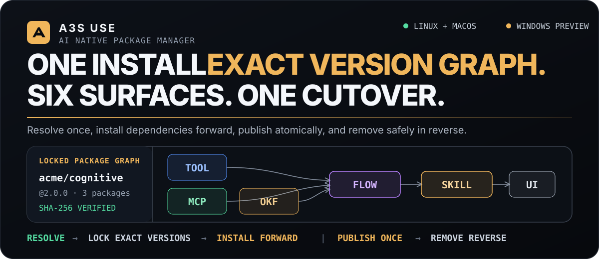
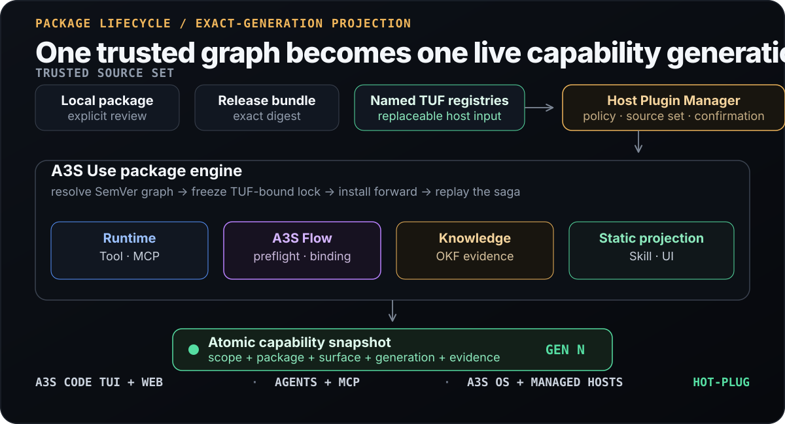

<p align="center">
  
</p>

<p align="center">
  <strong>AI Native Package Manager for native capabilities and versioned cognitive packages.</strong>
</p>

<p align="center">
  <a href="https://a3s-lab.github.io/Use/">Website</a> ·
  <a href="#install-or-build">Install</a> ·
  <a href="#cognitive-package-format">Package format</a> ·
  <a href="#replaceable-registries-and-exact-locks">Registries</a> ·
  <a href="#current-contract-baseline">Contracts</a> ·
  <a href="#implementation-status">Status</a> ·
  <a href="ROADMAP.md">Roadmap</a>
</p>

> [!WARNING]
> **Development preview — not production-ready.** The cognitive-package
> platform has not shipped a supported product release. Pre-release manifests,
> receipts, operation records, catalog metadata, and host protocols are not
> compatibility targets: unsupported state is rejected with a cleanup and
> reinstall instruction. Version tags do not change this release status.

## What A3S Use is

A3S Use resolves, verifies, installs, upgrades, and removes an exact SemVer
package graph. A cognitive package can contribute six named surfaces:
**Tool, MCP, OKF, A3S Flow, Skill, and UI**. The package is the lifecycle unit;
its User or Workspace installation is the consistency unit. Its surfaces are
prepared together and become visible through one immutable
capability-snapshot cutover.

It is designed for A3S hosts on Linux, macOS, and Windows. It does not try to
replace `apt`, Homebrew, or WinGet for arbitrary system software. A3S Use owns
package trust, immutable generations, receipts, dependency ordering, lifecycle
journals, and capability evidence. Runtime, Gateway, Flow, Knowledge, and UI
hosts keep ownership of execution and presentation.

The current architecture has five non-negotiable properties:

- **One installation graph:** each explicit User or Workspace installation has
  one monotonically generated `InstallationSnapshot`. It owns the unified
  resolved graph plus each package's enablement and selected-surface intent.
  Root locks are derived views; dependencies install forward, retirement runs
  in reverse, and one package ID cannot resolve differently beneath two roots
  in the same installation.
- **One reviewed mutation path:** planning is read-only; apply accepts the
  reviewed operation ID, plan digest, and confirmation. There is no direct
  enable/disable mutation API.
- **One serial installation mutation:** install, upgrade, uninstall, enable,
  disable, and exact recovery share a cross-process writer fence. Every
  reviewed cutover is bound to the expected capability generation; a losing
  concurrent plan fails before provider or package-publication effects.
- **One immutable content identity:** verified raw targets and expanded package
  trees are keyed only by digest in the global Artifact Store. Registry sources
  retain observations and partial downloads; installations own selections and
  lifecycle generations, never private copies of identical content.
- **One bounded Registry authority boundary:** the installation's authoritative
  `registry.json` snapshot is read and published only through an owned directory
  chain, no-follow/reparse-safe file handles, a 4 MiB byte ceiling, and
  atomic temporary-file replacement. A reader rechecks the opened file and
  rejects same-path changes instead of parsing an unbounded or redirected file.
- **One current protocol baseline:** pre-release formats are rejected rather
  than decoded, migrated, or silently defaulted.

## Proof in this repository

The implementation and fixtures exercise the product model directly:

- [`plugin-v3-cognitive`](crates/extension/fixtures/packages/plugin-v3-cognitive/)
  is a content-addressed package containing all six surface kinds.
- [`plugin-v3-mhs-bridge`](crates/extension/fixtures/packages/plugin-v3-mhs-bridge/)
  proves that a hardware adapter reuses the standard MCP, Flow, Skill, and UI
  graph, remains unpublished without its exact managed gateway binding, and
  requires no MHS-specific package surface.
- [`PluginPackageResolver`](crates/core/src/plugin/package_resolution.rs)
  resolves bounded SemVer closures and rejects cycles, incompatible releases,
  and cross-Registry ambiguity.
- [`InstallationSnapshot`](crates/core/src/plugin/installation_snapshot.rs)
  owns one scope's desired roots, unified lock graph, package state
  generations, enablement, and exact selected-surface publication intent.
- [`RegistrySourceStore`](crates/extension/src/registry_sources/mod.rs) persists
  canonical revision-addressed ACL source configuration, imports digest-bound
  trusted roots, and isolates TUF metadata and caches by source identity.
- [`ArtifactStore`](crates/extension/src/artifact_store.rs) stores expanded
  packages at one sharded global SHA-256 path, serializes concurrent commits by
  digest, rejects linked/reparse-point ancestors, and carries no installation
  or activation authority.
- [`CapabilityGatewayCatalogStore`](src/capability_catalog_store.rs) owns the
  exact Agent-facing catalog payload for one installation. It publishes
  immutable canonical records, supports explicit protected-set retention, and
  persists a bounded recovery journal so interrupted pruning can resume via
  `recover_retention()` without inventing lifecycle authority. The Gateway
  session factory's `from_published` and `replace_published` paths verify this
  exact durable publication before exposing a live endpoint. The inactive
  Control composition additionally binds the publication identity to the
  applied capability cutover and published cursor in one transaction.
- [`RegistryNetworkPolicy`](crates/extension/src/remote/network.rs) lets an
  embedding host select the strict public-Internet boundary for untrusted
  Registry endpoints. That mode requires HTTPS, pins checked DNS answers,
  rejects non-public address space and proxies, disables automatic redirects,
  rechecks bounded target redirects at every hop, and applies to TUF metadata,
  bootstrap roots, planning targets, and package targets alike.
- [`CognitivePackageManager`](src/cognitive_package/) binds signed catalog
  evidence, exact locks, reviewed plans, authorization, and crash replay.
- [`ExtensionRegistry`](crates/extension/src/registry.rs) keeps the published
  installation snapshot behind bounded, owned, cross-platform file IO so
  malformed, oversized, linked, or concurrently replaced authority cannot be
  admitted as a capability generation.
- [`CognitivePackageHostManager`](src/cognitive_package/host_manager.rs)
  implements the typed host-protocol-v6 port for one exact managed-scope
  fence. It durably binds request IDs to Use-owned plans and terminal results,
  while delegating Registry resolution, admission, lifecycle, Grants, and
  observation to the same `CognitivePackageManager` used by other hosts.
- [`bind_cognitive_package_provider_plan`](src/cognitive_package/provider_plan.rs)
  executes the authorization-safe two-pass provider protocol: unbound draft,
  assigned-provider preflight, host authority, canonical Grant semantics, and
  drift-checked final selection.
- [`PluginPackageGraphLifecycleCoordinator`](src/plugin_lifecycle/graph.rs)
  prepares dependency closures, performs one durable Registry cutover, drains
  accepted calls, and retires exact prior generations.
- [`RuntimeTaskDispatcher`](src/plugin_runtime/task_dispatch.rs) reopens the
  exact v4 Task binding and provider selected at review time, while capability
  snapshot v5 publishes only matching release-backed Tasks with complete
  installation and lifecycle identity.
- [`SqliteOkfKnowledgeAdapter`](src/okf_knowledge/sqlite/mod.rs) stages,
  promotes, searches, reads, and removes scope-isolated OKF projections with
  exact package-generation citations, retained source Markdown, bounded
  receipt-accounted storage, global tombstone pruning, physical SQLite
  compaction after removal, source/index integrity auditing, non-overwriting
  verified backups, exact-plan oldest-first backup rotation,
  authority-preserving FTS repair, and authority-bound database plus
  missing-binding restore.
- [`A3sFlowLifecycleHost`](src/flow_runtime/lifecycle.rs) delegates Flow
  preflight to the real `a3s-flow` Native TypeScript runtime and records an
  exact-generation binding.
- [`StandaloneCognitivePackageLifecycleFactory`](src/cognitive_package/hosts.rs)
  composes that host only from an explicit absolute compiler path; failed
  preflight remains unpublished and can replay from exact durable evidence.
- Contract fixtures under [`crates/core/fixtures/plugins`](crates/core/fixtures/plugins/)
  freeze canonical JSON and SHA-256 digests for the current schemas.

CI runs formatting, the complete A3S Use workspace tests, Clippy,
release-container conformance, and platform jobs. The Windows preview gate now
executes the complete current workspace suite, including a real
directory-junction regression for the shared reparse-point guard. The native
Windows suite also proves Registry cutover-capacity rejection happens before
any lifecycle-receipt replacement and that Box delegation preserves arguments,
output, and exit status through a native command script. Resumable Registry
partials are opened without following their final path and stay owned by one
handle; the Windows gate proves an active partial permits readers but rejects
external writes and removal until the transaction releases it. Signed Registry,
dependency-graph, Grant, Flow-preflight/lifecycle, and standalone OKF scenarios
also run through the real CLI. Its killed-process coverage now
includes a multi-node install killed after the durable Registry graph publish
but before dependency journal and installation snapshot completion,
removed-dependency cleanup after upgrade cutover, and an uninstall killed after the durable
Registry hide but before the package hide receipt. The install replays the
exact cutover offline without another generation or network request. The
uninstall restarts from the same plan, blocks on the accepted-call generation
lease, then drains and retires scoped generation authority without another
Registry generation; missing package state without the exact cutover still
fails closed.
Lifecycle commit and cleanup retry Windows access, sharing, and lock violations
for at most two seconds per blocking mutation. Transient scanner handles over
an active artifact staging directory, selected upgrade receipt, removal
receipt, or nested abandoned staging file let the same commit or authority
retirement continue. A persistent active-staging handle fails before receipt
or Registry-snapshot mutation, preserves the residual tree, and lets commit
replay exactly after release. A persistent selected-receipt lock retains the
valid global candidate artifact and rolls back retained-receipt state while
preserving the byte-exact prior receipt and published generation; upgrade
replay succeeds after release. A persistent reader over a complete global
artifact does not block uninstall, and the shared bytes remain available.
A test-binary subprocess matrix also exits after each durable host effect but
before its receipt for every canonical install, upgrade, enable, disable, and
uninstall checkpoint; recovery reuses the exact idempotency key without
duplicating an effect, and terminal replay makes no host call. A second
test-binary subprocess matrix covers grant-bearing install, upgrade, and
uninstall graph cutovers: it exits after the atomic publish or hide effect
but before package publication receipts and Grant cutover evidence,
then proves exact-key recovery, one graph effect, completed package and Grant
journals, and terminal replay without another publish or hide. Separate
managed-scope manager processes are externally killed during five-node install,
upgrade, and uninstall after Registry publish/hide while one dependency
publication receipt is pending and the Grant journal remains prepared. Restart
runs with reauthorization disabled, performs no network request, preserves the
exact candidate Grant, retires only the bound prior Grant, completes package
and Grant journals, and does not advance the Registry generation again. Five
real `CognitivePackageHostManager` protocol children additionally cover the
complete reviewed apply set after the Registry server is stopped. Install,
upgrade, and uninstall are killed at the corresponding five-node graph
publish/hide boundaries. Disable is killed after the root package binding is hidden and
Grant cutover commits while an accepted-call lease blocks drain; enable is
killed after Registry publication while its candidate Grant remains prepared.
Restart consumes the durable reviewed plan and confirmation; install and
upgrade also use only the verified planning cache. Recovery does not
reauthorize, converges the exact candidate/prior Grant or enablement
regrant/revocation, completes drain and both journals without generation
inflation, persists the Host outcome, and remains terminally replayable. These
paths do not replace the still-open actual product-host and complete
cross-platform failure-injection gates. The Grant
Store itself also
operates a test-binary subprocess matrix across all 14 durable checkpoints in
its canonical two-candidate/two-retirement lifecycle: forward prepare,
cutover/retirement, and pre-cutover rollback each include every candidate
receipt, prior revocation, and candidate restoration.
See [Platform support](#platform-support).

## Install or build

Tagged archives remain development previews. The installers select the current
OS and architecture, require Cosign, authenticate `checksums.txt` against the
exact A3S Use tag workflow identity and GitHub OIDC issuer, verify the selected
archive SHA-256 before extraction, reject unsafe archive entries, and
atomically publish a user-scoped command. Download the installer first so it
can be reviewed before execution.

Linux or macOS:

```bash
curl --proto '=https' --tlsv1.2 -fsSLo /tmp/a3s-use-install.sh \
  https://raw.githubusercontent.com/A3S-Lab/Use/main/install.sh
sh /tmp/a3s-use-install.sh
```

Windows x86_64 with Windows PowerShell 5.1 or PowerShell 7:

```powershell
$installer = Join-Path $env:TEMP 'a3s-use-install.ps1'
Invoke-WebRequest https://raw.githubusercontent.com/A3S-Lab/Use/main/install.ps1 -OutFile $installer
& $installer
```

`cosign` must be installed on `PATH`; an explicit trusted executable can be
selected with `--cosign <path>` on Unix or `-CosignPath <path>` on Windows.

Pass `--version <version>` on Unix or `-Version <version>` on Windows to pin a
tag. Unix installs under `$XDG_DATA_HOME/a3s-use` (or
`$HOME/.local/share/a3s-use`) and links from `$HOME/.local/bin`. Windows uses
`%LOCALAPPDATA%\A3S\Use`, creates an owned command shim under
`%LOCALAPPDATA%\A3S\bin`, and adds that bin directory to the user `PATH` unless
`-NoPathUpdate` is set. The managed launcher binds the packaged OCR models,
OCR Skills, and Browser Skills while preserving explicit environment
overrides. Reinstalling the same version revalidates the complete installed
tree. Missing Cosign, invalid Sigstore evidence, a checksum mismatch, tampered
existing release, unsafe path, link/reparse point, concurrent installer, or
unmanaged command conflict fails without changing the active command. The
verified checksum manifest and Sigstore bundle are retained in the immutable
version directory. See
[Verified release installation](docs/release-installation.md) for the trust
boundary and custom-path options.

The tagged-release workflow is designed to publish deterministically serialized
archives, one SPDX JSON SBOM per platform, GitHub OIDC build-provenance and SBOM
attestations, and a keyless Sigstore bundle for `checksums.txt`. It pins every
Action plus the Rust, Python, Syft, and Cosign versions, derives archive
timestamps from the tag commit, and verifies its checksum signature before
publication. The installers fail closed unless Cosign authenticates that same
bundle against the exact tag identity before the archive is downloaded. For
every target, a second clean runner without a compiled-artifact cache rebuilds
all shipped native executables and must byte-match the primary archive before
deterministic `.reproducibility.json` evidence can be attested, checksummed,
signed, and published beside the archive.

The `v0.3.7` Rust compatibility release keeps the post-`v0.3.3`
atomic-snapshot-lease, shared manager, Runtime service rebinding, and standard
MCP manager contracts while carrying the path-free Capability Gateway
descriptor/catalog adapter. Complete snapshots carry bounded, canonical
Runtime plan archives through clean-target staging, activation, and crash
replay; artifact reachability retains blobs referenced by committed plans. It
aligns the facade's exact `a3s-flow 1.1.0` registry dependency with
`a3s-code-core 8.0.3` and publishes `a3s-use-core 0.2.6`,
`a3s-use-extension 0.3.7`, and `a3s-use 0.3.7`. The facade continues to use the
same released Browser 0.3.2 provider as A3S Search, so a packaged consumer can
resolve one nominal Browser/Core/Flow capability graph. This is a compatibility
release and does not change the development-preview status. The Gateway
adapter remains a contract-level increment until lifecycle lease/drain,
authentication, CLI wiring, and independent-client qualification are complete.

The tagged `v0.3.2` workflow exposed native linker metadata drift on four of
five targets and therefore did not create a GitHub Release. The non-publishing
[qualification run 33651777660](https://github.com/A3S-Lab/Use/actions/runs/33651777660)
froze `main` commit `4f6e4725205d06ab81f8ea98bfee85c7eb4b2bcd` and passed the
complete five-platform archive, isolated-install path scan, SBOM and
attestation, and cache-free byte-for-byte rebuild matrix; it remains historical
evidence and never publishes assets. The earlier `v0.3.5` publication attempt
did not create a GitHub Release because the public `a3s-use-core` crate was
still `0.2.4`. Release workflow
[33675697857](https://github.com/A3S-Lab/Use/actions/runs/33675697857) then built
tag `v0.3.6` from exact `main` commit
`54758910f2f4ad9498137410e0a2207d412e99a1`, passed all primary and independent
five-target jobs, and published the development-preview
[v0.3.6 Release](https://github.com/A3S-Lab/Use/releases/tag/v0.3.6) with the
`a3s-use-core 0.2.5`, `a3s-use-extension 0.3.6`, and `a3s-use 0.3.6` packages.
Release workflow
[33687297386](https://github.com/A3S-Lab/Use/actions/runs/33687297386) then built
tag `v0.3.7` from exact `main` commit
`48a0b76f8a4a87a11d16627c7bd7567920852508`, passed all primary and independent
five-target jobs, and published the development-preview
[v0.3.7 Release](https://github.com/A3S-Lab/Use/releases/tag/v0.3.7) with the
`a3s-use-core 0.2.6`, `a3s-use-extension 0.3.7`, and `a3s-use 0.3.7` packages.
Release workflow
[33720485826](https://github.com/A3S-Lab/Use/actions/runs/33720485826) then built
tag `v0.3.8` from exact `main` commit
`6d3a7baf32ce998a2e487c40fbf78b4a6cda2579`, passed the complete validation,
five-target primary build, and independent cache-free rebuild gates, and
published the development-preview
[v0.3.8 Release](https://github.com/A3S-Lab/Use/releases/tag/v0.3.8) with the
`a3s-use-core 0.2.7`, `a3s-use-extension 0.3.8`, and `a3s-use 0.3.8` packages.
Release workflow
[33756618837](https://github.com/A3S-Lab/Use/actions/runs/33756618837) then built
tag `v0.3.9` from exact `main` commit
`a5f3cc40bfb0a1021ca150d2ce4295409b74d220`, passed complete validation,
five-target primary builds, and five independent cache-free rebuilds, and
published 19 verified release assets in the
[v0.3.9 Release](https://github.com/A3S-Lab/Use/releases/tag/v0.3.9), including
archives, installers, checksums/Sigstore, SBOM and reproducibility evidence,
and the `a3s-use-core 0.2.7`, `a3s-use-extension 0.3.9`, and `a3s-use 0.3.9`
packages.
Release workflow
[33791616307](https://github.com/A3S-Lab/Use/actions/runs/33791616307) then built
tag `v0.3.10` from exact `main` commit
`c4c80a223bfff3698ca4b4598e7175c6e3303239`, passed complete validation,
five-target primary builds, and five independent cache-free rebuilds, and
published 19 verified release assets in the
[v0.3.10 Release](https://github.com/A3S-Lab/Use/releases/tag/v0.3.10), including
archives, installers, checksums/Sigstore, SBOM and reproducibility evidence,
and the `a3s-use-core 0.2.8`, `a3s-use-extension 0.3.10`, and `a3s-use 0.3.10`
packages.
Release workflow
[33830280138](https://github.com/A3S-Lab/Use/actions/runs/33830280138) then built
tag `v0.3.11` from exact `main` commit
`c25028ae0245ba1d28f7e2837e2a87f7e9f6fe40`, passed validation, five-target
primary builds, and five independent cache-free rebuilds, and published 19
verified release assets in the
[v0.3.11 Release](https://github.com/A3S-Lab/Use/releases/tag/v0.3.11), including
archives, installers, checksums/Sigstore, SBOM and reproducibility evidence,
and the `a3s-use-core 0.2.9`, `a3s-use-extension 0.3.11`, and `a3s-use 0.3.11`
packages.
An externally operated full-archive witness, evidence retention outside GitHub
Release, and the remaining product gates are still open, so this does not
change the preview status above. Operators can additionally verify successful
GitHub attestations by following [Verified release installation](docs/release-installation.md#additional-independent-verification).

### Build and verify

Rust 1.85 or newer is required. Until the product release gate is complete,
build from source:

```bash
git clone https://github.com/A3S-Lab/Use.git
cd Use
cargo build --workspace --bins --locked
./target/debug/a3s-use doctor \
  --scope-kind user --scope-id user/alice --json
./target/debug/a3s-use capability snapshot \
  --scope-kind user --scope-id user/alice --json
```

Rust embedding hosts can bind the same authoritative Extension Registry to the
typed capability bridge and pin one complete published generation:

```rust
use a3s_use::capability_registry::CapabilityRegistry;

let capabilities = CapabilityRegistry::new(extension_registry);
let observed = capabilities.snapshot().await?;
let lease = capabilities
    .acquire_snapshot_lease(observed.cursor())
    .await?
    .ok_or_else(|| a3s_use::core::UseError::new(
        "host.capability_snapshot_stale",
        "The observed A3S Use generation is no longer callable.",
    ))?;
```

The cursor binds the Installation Snapshot generation and digest, capability
revision, Registry revision, and sorted exact package generations. Acquisition
takes every package-generation lease in canonical order and rechecks both
immutable authorities after the complete batch is held.
A hidden, stale, mixed, contended, or digest-mismatched generation returns no
lease; an enabled legacy package binding without immutable lifecycle evidence fails
closed. The non-clone RAII lease is `Send + Sync`, so A3S Code can retain it in
a Run scope while Use lifecycle retirement waits for accepted work to drain.
Dropping it only releases synchronous generation locks; asynchronous cleanup
remains explicitly owned by the Use lifecycle coordinator.

Capability watches now subscribe to the atomic Extension Registry publication
instead of rebuilding the complete projection on a fixed interval. The native
filesystem backend is preferred, while a bounded target-metadata probe runs
alongside it to catch atomic replacements that a platform backend can coalesce
or omit; a metadata-only polling backend is used when native registration is
unavailable. Events are target-filtered and coalesced into one bounded signal;
the validated `registry.json` remains the authority. `CapabilityRegistry`
rebuilds and hashes the full projection at subscription setup, after a real
generation advance, and once at timeout to close the final race. This removes
repeated package scans and asset hashing from the normal wait path without
creating a second mutable generation cursor.
Persisting the complete agent-facing descriptor catalog in the lifecycle
Capability Index remains a separate product gate.

The `capability snapshot --json` schema v5 remains the outer CLI envelope. It
exposes the Installation Snapshot generation and digest, while the complete
in-process cursor is deliberately not appended to that independently released
schema. Managed-MCP, Skill identity, and UI
dependency fields are explicit. Each extension MCP surface keeps its canonical
ID and multiplicity, a collision-resistant host server name, activation,
package/manifest/generation identity, reviewed file-evidence digest, and one
transport-specific launch projection. Stdio projections contain only a
package-relative executable and bounded arguments. Streamable HTTP projections
contain only a package-relative release, opaque endpoint reference/path, and
exact Runtime/Gateway readiness digests; resolved URLs and credentials never
enter the snapshot. Every UI contribution carries
`a3s.use.ui-dependency-evidence.v1` so an empty dependency list is distinguishable
from an older host that did not publish dependency evidence.

The standalone CLI currently exposes package-graph lifecycle, diagnostics,
capability observation, built-in Browser/OCR routes, cited OKF search, and
exact-scope Knowledge storage operations:

```text
a3s-use install <publisher/name> --scope-kind <user|workspace> --scope-id <id> [--registry-name <name>] [--offline] [--json]
a3s-use upgrade <publisher/name> --scope-kind <user|workspace> --scope-id <id> [--registry-name <name>] [--offline] [--json]
a3s-use uninstall <publisher/name> --scope-kind <user|workspace> --scope-id <id> [--json]
a3s-use plugin search <query> --scope-kind <user|workspace> --scope-id <id> [--kind <flow|mcp|okf|skill|tool|ui>] [--channel <stable|beta|nightly>] [--cursor <cursor>] [--limit <n>] [--offline] [--json]
a3s-use plugin inspect <publisher/name> --scope-kind <user|workspace> --scope-id <id> [--version <semver>] [--channel <stable|beta|nightly>] [--offline] [--json]
a3s-use plugin list-installed --scope-kind <user|workspace> --scope-id <id> [--cursor <cursor>] [--limit <n>] [--json]
a3s-use plugin status <publisher/name> --scope-kind <user|workspace> --scope-id <id> [--json]
a3s-use plugin plan-install <publisher/name> --scope-kind <user|workspace> --scope-id <id> [--registry-name <name>] [--version-requirement <semver-range>] [--channel <stable|beta|nightly>] [--surface <kind/id>]... [--offline] [--json]
a3s-use plugin plan-upgrade <publisher/name> --scope-kind <user|workspace> --scope-id <id> [--version-requirement <semver-range>] [--channel <stable|beta|nightly>] [--surface <kind/id>]... [--offline] [--json]
a3s-use plugin plan-uninstall <publisher/name> --scope-kind <user|workspace> --scope-id <id> [--json]
a3s-use plugin plan-enable|plan-disable <publisher/name> --scope-kind <user|workspace> --scope-id <id> [--json]
a3s-use plugin apply-plan --operation-id <id> --plan-digest <sha256> --scope-kind <user|workspace> --scope-id <id> --yes [--json]
a3s-use plugin observe-operation <publisher/name> --operation-id <id> --plan-digest <sha256> --scope-kind <user|workspace> --scope-id <id> [--json]
a3s-use plugin watch-operation <publisher/name> --operation-id <id> --plan-digest <sha256> --scope-kind <user|workspace> --scope-id <id> [--after-revision <sha256>] [--timeout-ms <ms>] [--json]
a3s-use plugin cancel-operation <publisher/name> --operation-id <id> --plan-digest <sha256> --scope-kind <user|workspace> --scope-id <id> --yes [--json]
a3s-use extension inspect <publisher/name> --scope-kind <user|workspace> --scope-id <id> [--json]
a3s-use extension diagnose <publisher/name> --scope-kind <user|workspace> --scope-id <id> [--history] [--json]
a3s-use knowledge search <query> --scope-kind <user|workspace> --scope-id <id> [--limit <n>] [--json]
a3s-use knowledge usage --scope-kind <user|workspace> --scope-id <id> [--json]
a3s-use knowledge audit --scope-kind <user|workspace> --scope-id <id> [--json]
a3s-use knowledge backup <path> --scope-kind <user|workspace> --scope-id <id> [--json]
a3s-use knowledge verify-backup <path> --scope-kind <user|workspace> --scope-id <id> [--json]
a3s-use knowledge backup-retention <directory> --scope-kind <user|workspace> --scope-id <id> [--max-backups <n>] [--max-bytes <n>] [--plan-digest <sha256> --yes] [--json]
a3s-use knowledge plan-restore <path> --scope-kind <user|workspace> --scope-id <id> [--json]
a3s-use knowledge restore <path> --plan-digest <sha256> --scope-kind <user|workspace> --scope-id <id> --yes [--json]
a3s-use knowledge restore-status --scope-kind <user|workspace> --scope-id <id> [--json]
a3s-use knowledge repair-search-index --scope-kind <user|workspace> --scope-id <id> --yes [--json]
a3s-use registry source list [--json]
a3s-use registry source add <name> (--url <https-url> | --github <owner/repository>) --trust-root <sha256> [source options] [--json]
a3s-use registry source replace <name> (--url <https-url> | --github <owner/repository>) --trust-root <sha256> --expected-revision <sha256> --yes [source options] [--json]
a3s-use registry source default|enable|disable|remove <name> --expected-revision <sha256> --yes [--json]
a3s-use registry cache usage [--registry-name <name>] [--json]
a3s-use registry cache prune [--registry-name <name>] [cache options] --yes [--json]
a3s-use state backup <path> --scope-kind <user|workspace> --scope-id <id> [--json]
a3s-use state verify-backup <path> --scope-kind <user|workspace> --scope-id <id> [--json]
a3s-use state backup-retention <directory> --scope-kind <user|workspace> --scope-id <id> [--max-backups <n>] [--max-bytes <n>] [--plan-digest <sha256> --yes] [--json]
a3s-use state plan-restore <backup> --scope-kind <user|workspace> --scope-id <id> [--json]
a3s-use state restore <backup> --rollback-backup <external-path> --plan-digest <sha256> --scope-kind <user|workspace> --scope-id <id> --yes [--json]
a3s-use state restore-status --scope-kind <user|workspace> --scope-id <id> [--json]
a3s-use capability snapshot|watch --scope-kind <user|workspace> --scope-id <id> [options] [--json]
a3s-use mcp serve manager --scope-kind <user|workspace> --scope-id <id> [--offline]
```

`mcp serve manager` speaks standard MCP on stdout and therefore must not be
combined with `--json`. The `manager`, `package-manager`, and
`use/package-manager` target names are equivalent. It composes the same typed
`PluginManagerService` used by the CLI and TUI; it does not create a second
catalog, plan, confirmation, or mutation path.

Standalone Registry-backed `install`, `upgrade`, and `uninstall` now plan and
apply through the shared `PluginManagerService`. Their existing component and
`packageGraph` fields remain available, while JSON output also includes a
`pluginManager` object containing the exact operation ID, plan digest, reviewed
Host plan result, and terminal Host apply result. Repeating an unchanged
operation returns the durable replay result. Offline planning and recovery stay
zero-network, and a supplied package-lock digest is rejected before any target
download. The compatibility commands auto-apply only permission-free `Allow`
plans. The one-to-one `plugin` commands expose the same four read operations,
five read-only planning operations, digest-only apply, exact operation
observation/watch, and explicit cancellation boundary as manager toolset v5.
Each successful JSON `data` value is the exact typed service result,
including the complete Host plan, package lock, source and permission evidence,
operation ID, plan digest, confirmation decision, and terminal apply result.
Planning never mutates package state. `plugin apply-plan` reopens only the exact
durable `(operation ID, plan digest)` pair and requires `--yes`; an ordinary CLI
call does not imply user confirmation, and an `Ask` plan receives confirmation
only at that explicit boundary. Exact apply and replay use the verified planning
cache without Registry access. A3S Code CLI, TUI `/packages`, and the standard
manager-v5 MCP now compose this same service without a presentation-owned plan,
confirmation, or mutation path. Every standalone manager command requires an
explicit User or Workspace installation. The selected `InstallationId` owns the
manager and all mutable state; User and Workspace installations with the same
textual ID remain distinct authority domains.

Runtime, Flow, Knowledge, and lifecycle evidence stores capture that exact
`InstallationId` when they are constructed. A receipt, query, recovery item,
or lifecycle intent for another installation fails with
`use.installation.identity_mismatch` before Use derives a path, acquires a
store lock, creates a database, or writes evidence. Separate installations use
separate stores while immutable Registry and artifact inputs remain shareable.

The scoped layout and global Artifact Store are intentional pre-release clean
cutovers, not migrations. If `use.installation.legacy_state_unsupported` or
`use.artifact_store.legacy_state_unsupported` is reported, stop old Use hosts,
preserve the prior roots for incident review, and remove only the proven legacy
entries before reinstalling with explicit scope flags. These entries include
the old global `data/extensions`, installation-scoped
`data/installations/<kind>/<key>/extensions`, and old state-level `extensions`,
`registry.json`, generation, Grant, binding, lifecycle, Knowledge, graph,
enablement, Host Manager, route-lock/generation-lease, and mutation-lock paths. Preserve global
`registries.acl`, Registry trust roots, TUF metadata/targets, and
`data/artifacts`; they are inputs shared by installations.

Expanded content lives at
`data/artifacts/expanded-packages/sha256/<prefix>/<digest>/content`. Different
installations may point to the same exact tree while retaining independent
receipts, generations, enablement, Grants, bindings, and leases. Use rehashes
content before publication and use. Global bytes are deleted only through an
explicit confirmed Artifact Store garbage-collection plan; source cleanup and
scoped uninstall still never delete them. A
cross-process shared/exclusive boundary now prevents future inventory and
collection from racing raw-target observations, lifecycle receipts,
applying lifecycle journals, installation snapshots, or pending graph
operations. Source observations and resumable partials remain Registry-source
scoped; their verified bytes use the global Blob tier. The library exposes a
bounded, deterministic, path-free physical inventory under the exact exclusive
store guard. It reports canonical content and abandoned staging separately and
fails closed on unknown layout, links/reparse points, special files, or
traversal limits. A separate path-free Registry reference inventory derives
every canonical blob observation from all preserved source datastores,
including replaced sources, under the same guard. The global path-free
`a3s.use.artifact-reference-inventory.v1` view now aggregates those observations
with every installation snapshot, current and retained receipt, non-cancelled
package-graph operation, applying or rolling-back lifecycle journal, and
immutable Runtime plan payload. Runtime plan records are decoded while holding
the installation maintenance and plan-store locks, so their referenced Blob
artifacts remain reachable during cleanup. Production publication through an
`ExtensionPaths`-bound plan store acquires global reference admission before
that installation fence; stores created for isolated offline/test state do not
carry a global Artifact Store boundary. It validates installation identity and
source layout, rejects conflicting physical expectations, and retains
references even when content is missing. The joined
`a3s.use.artifact-reachability-inventory.v1` view captures that logical evidence
and the physical inventory in one guarded collection pass. New publication is
frozen; reference retirement can only leave conservative extra owners. One row
per artifact keeps owners, physical measurements, expectation status, and
checked global storage usage distinct.

The Artifact Store now owns an optional durable hard-quota policy at
`data/artifacts/storage-quota.acl`. `ArtifactStore::storage_quota`,
`set_storage_quota`, and `clear_storage_quota` expose canonical ACL state through
revision compare-and-swap. The policy bounds logical regular-file lengths and
digest containers, not allocated filesystem blocks. Publication always enters
reference admission first, then the global storage boundary, then the exact
digest lock. With no policy, publishers share the storage boundary. With a
policy, the final Blob or expanded-package publication holds it exclusively,
scans current content plus abandoned staging, projects the exact prepared write,
and retains the lock through staging cleanup and atomic commit. Distinct
processes therefore cannot both spend the same remaining capacity. If an
operator tightens the policy below current usage, exact replay and cleanup that
do not worsen either exceeded dimension remain possible. A malformed policy
fails writes closed without suppressing physical inventory evidence.

`ArtifactStore::audit_digests` now performs an explicit full-store integrity
pass under the exact store-bound collection guard. Its deterministic,
path-free `a3s.use.artifact-store-digest-audit.v1` report sequentially rehashes
complete raw Blobs with raw SHA-256 and expanded packages with the same
canonical package fingerprint used at admission. It reports `verified`,
`mismatch`, and un-hashed `incomplete` outcomes plus checked byte/file totals.
The pass repeats the bounded physical inventory before returning, so admitted
publication is frozen for the complete operation and observable layout or
measurement drift fails closed. Digest mismatches remain evidence; the audit
never removes, overwrites, quarantines, or rehydrates content.

Effect owners now have a path-free verified read boundary instead of treating
`expanded_package_path` as authority. `ArtifactStore::acquire_verified_package`
accepts one complete verified catalog record, takes the global reachability and
per-artifact mutation locks in shared mode, rejects interrupted collection and
logical quarantine, and revalidates the full package fingerprint, manifest
digest, exact byte/file counts, manifest-to-catalog surface graph, and every
declared surface file. The non-cloneable lease exposes only catalog identity and
the parsed manifest; its `Debug` form contains no local path. Manifest reads are
bounded before ACL parsing, missing locks are never created by a read, and
`verify_unchanged` repeats the complete verification to detect uncoordinated
local tampering before an adapter records success.

Logical corruption quarantine is a separate exact-plan operation.
`ArtifactStore::plan_quarantine` accepts only one complete mismatch from a fresh
audit under the same exact collection guard and returns canonical, path-free
evidence. `apply_quarantine` re-audits the bytes, requires the exact reviewed
plan digest, and atomically publishes a bounded canonical `quarantine.json`
record without moving or overwriting `content`. Replay of the same record is
idempotent. Failed recovery retains its bounded temporary fail-closed sentinel,
so ordinary access does not reopen between retries. Physical inventory
validates active and interrupted quarantine metadata but excludes it from
content and staging quota measurements. New Blob
opens, observations, and commits plus expanded-package validation and commits
fail closed once a marker exists. This marker preserves forensic bytes and
blocks ordinary future use; it does not revoke already-open handles, rewrite an
admitted generation, authorize rehydration, or authorize deletion.

Verified rehydration is a separate reference-aware mutation coordinated by
`ArtifactStoreMaintenance`. Planning and every nonterminal apply acquire the
exact global collection guard and rescan every Registry observation,
installation snapshot, current or retained receipt, pending package graph, and
nonterminal lifecycle operation; the target must have zero durable references
before replacement. The independently supplied candidate must live outside the
Artifact Store and match the expected Blob SHA-256 or canonical expanded-package
fingerprint. Planning emits only path-free evidence. Initial apply requires its
exact canonical digest, reverifies the candidate and quarantine binding,
durably publishes prepared evidence, and keeps ordinary access fail-closed
while it stages and switches canonical content. A matching completion record
opens access. Exact terminal replay is read-only: it validates the completion,
quarantine binding, and canonical replacement without reopening the external
candidate or requiring later owners to retire again. Interrupted preparation or
content switching resumes from bounded state, moved or conflicting records fail
closed, and hard quota admission accounts for the temporary recovery peak.
Apply consumes the reviewed corrupt forensic bytes; operators that require
longer evidence retention must archive them outside the store before
confirmation. Existing open handles are not revoked, but no admitted package
generation may reference the target during replacement.

Confirmed Artifact Store garbage collection is a separate reference-aware
mutation coordinated by `ArtifactStoreMaintenance`. Its policy is a non-empty,
bounded, canonical allowlist of exact `(kind, digest)` targets; there is no
timer, age threshold, quota-triggered sweep, or implicit "all unreferenced"
mode. Planning holds the global collection guard, proves zero durable owners
across every Registry, installation, receipt, snapshot, and nonterminal
operation, and binds exact physical measurements plus ordinary, quarantined,
or completed-rehydration lifecycle evidence into a path-free plan. Apply
repeats the zero-reference proof and accepts only the reviewed canonical plan
digest. Before any namespace mutation it publishes a durable global prepared
record. Each reviewed digest container is then atomically renamed within its
shard to a deterministic tombstone and removed through a bounded, no-link
residual-tree check. Prepared or temporary state blocks new reference
admission across restart until the same plan resumes. A durable completion
record makes exact replay read-only, so an old confirmation cannot delete an
identical digest that was later recreated or newly referenced; each later plan
chains to the previous completion digest. Quarantine, rehydration, audit, quota
pressure, and physical unreachability are evidence only and never independently
authorize deletion.

The joined quota assessment remains evidence only; it does not authorize
deletion. Hard admission is deliberately serialized rather than implemented as
a parallel durable reservation ledger. `complete` remains only a physical
publication state; the explicit digest audit produces a separate integrity
result. Exact-plan logical quarantine and zero-reference verified rehydration
remain separate from explicit confirmed garbage collection; none grants the
authority of another.

The default Knowledge policy bounds each complete User or Workspace scope to
512 MiB of receipt-accounted expanded content, 256 retained projections, 32
generations per surface, and 256 removal tombstones. Staging checks the whole
scope atomically; receipt-owned removal frees quota, prunes old tombstones, and
compacts SQLite plus its WAL. `knowledge usage --json` reports the exact scope,
current counts, quota, allocated database bytes, and reclaimable bytes. These
standalone controls also audit SQLite, receipt, scope, foreign-key, and FTS
consistency. Backup writes one versioned, SHA-256-bound SQLite snapshot without
overwriting an existing file; verification reopens and audits the embedded
database offline. `knowledge backup-retention` verifies every managed
`*.a3s-okf-backup` candidate in one owned directory, isolates the exact scope,
and returns an oldest-first bounded plan. It removes nothing until `--yes` and
the unchanged canonical `planDigest` are supplied, never removes the last
verified scope backup, and reports partial deletion as outcome-unknown.
Search-index repair requires `--yes` and rebuilds only FTS
rows derived from already-validated documents. It never rewrites package
receipts, projection state, or authorization evidence. Authority-bound restore
separates path-free plan review from digest-only confirmed apply, verifies the
complete Registry/package/lifecycle/Grant authority and exact-subset binding
inventory, binds the live main/WAL/SHM evidence, restores only missing binding
files, preserves prior files, and resumes a six-state durable journal after
process exit. Conflicting or newer binding evidence fails closed. `knowledge
restore-status --json` reads the selected installation's active marker and
bounded path-free history without a
backup path or plan digest; it reports current phase, exact digests, retained
directory count, unrecorded marker-handoff directories, and remaining capacity
without changing restore or database evidence.

The backup is an integrity-checked scope database snapshot, not a signed trust
artifact or a whole-product restore. Standalone restore may recreate binding
files only when the current set is an exact subset of the backup and Registry
receipts, immutable package roots, lifecycle journals, and Grants remain
exact. It cannot recreate those independent authorities. Broader authority
recovery, clean-machine recovery, cross-platform operational drills, and
whole-product rollback-evidence retention still require a procedure.
Every installation-scoped operation requires explicit `--scope-kind` and
`--scope-id`; the CLI never guesses a current User or Workspace identity. See
[OKF Knowledge operations](docs/okf-knowledge-operations.md).

For a quiescent whole-installation inventory, `state backup` takes that
installation's exclusive maintenance fence and snapshots Registry,
installation-snapshot, retained-generation, Grant, binding,
lifecycle/package-operation, Knowledge, enablement, and Host Manager control
state. Expanded package bytes are global immutable inputs and are not copied.
Its
`a3s.use.state-backup.v2` manifest binds the exact installation and contains
only portable relative paths,
per-file length/SHA-256/mode evidence, family accounting, the Registry
generation/digest, and sorted installed-receipt digests. Creation scans, copies
with exact hashing, then rescans before non-overwriting publication. Locks are
excluded; an active restore, pending cutover/operation, link/reparse point,
special file, unknown state family, installation data payload, or non-portable
path fails closed. `state verify-backup` validates canonical
manifest bytes, complete archive length, and every payload digest offline
without extraction or local Use state. The archive contains raw state and must
be protected as sensitive data. `state backup-retention` takes a separate
external-directory lock, fully verifies every managed archive, and returns a
path-free oldest-first plan that binds the exact file name, modification time,
length, manifest digest, inventory digest, and Registry evidence. Confirmed
apply accepts only the unchanged canonical `planDigest`, synchronizes each
deletion, filters archives by exact installation, and always retains at least
the newest two verified archives. Global Registry source/trust/TUF state, the
Artifact Store, and derivable Flow compiled artifacts are deliberately outside
this backup.
`state plan-restore` builds a path-free Add/Replace/Remove/Retain review only
when the backup exactly matches the current Use version, OS, architecture, and
independently retained Registry/receipt/Grant authority. Confirmed `state
restore` first creates or verifies an explicit external rollback archive,
stages only publication candidates, and advances a durable seven-phase journal
whose 15 process-exit boundaries converge idempotently. The active marker is
published before live mutation, candidate links/reparse points and marker or
journal substitution fail closed, completed history is bounded to 64 records,
and `state restore-status` is path-free and read-only. The archive remains
integrity evidence, not a signature or missing-authority recovery mechanism;
clean-machine recovery and operational disaster-recovery drills remain open. See
[Coordinated state backup operations](docs/state-backup-operations.md).

`extension inspect --json` includes the latest and previous durable lifecycle
operations for the explicitly selected installation. The versioned diagnostic projection
reports action, status, generation, artifact digests, checkpoint progress,
bounded error codes, timings, and rollback evidence. It deliberately omits
checkpoint idempotency keys, credentials, tokens, secret values, and
package-authored error text. This is checkpoint evidence for diagnosis, not a
telemetry service or backup/restore mechanism.
One reviewed graph operation can create consecutive candidate and retirement
phase intents for the same package. Those records intentionally share an
`operationId`; consumers distinguish the exact phase by `intentDigest`, action,
generation, and artifact digests.

`extension diagnose --json` reads either one exact retained install, upgrade,
or uninstall graph, one active admitted enable/disable operation, or the newest
Host-reviewed enable/disable plan that has not been admitted for the selected
User or Workspace scope without network I/O, reconciliation, recovery, or
writes. Its
`a3s.use.plugin-operation-diagnostic.v1` projection binds the reviewed plan and
lock digests, path-free Registry name and TUF role versions, current Registry
generation and cutover evidence, provider identity/readiness, Grant journal
phase, lifecycle publication/drain/rollback state, and stable recovery
guidance. Graph diagnostics cover retained planned, admitted, and cancelled
operations and work before installation when only the reviewed pending plan
exists. Before enable/disable admission, a digest-bound observation index
selects the newest exact Host plan by `(plannedAtMs, requestId)` and projects
`planned` or `cancelled`, selected provider and awaiting-Grant state, the
expected lifecycle-unit count, and current Registry cutover evidence. The
index keeps the managed Host scope only to resolve its immutable request; Host
IDs, authority/fence values, request IDs, and private paths never enter the
public projection. Active Use-owned enablement evidence takes precedence, and
a durable Host outcome or completed Use operation suppresses the stale plan.
URLs, paths, idempotency keys, credentials, tokens, secret names and values,
package content, and arbitrary package-authored text are excluded.
For a retained install or upgrade graph, the projection also reports total
expected and currently retained archive bytes plus each exact target's
`missing`, `partial`, or `complete` cache state; the aggregate is `missing`,
`in-progress`, or `complete`. Before a reviewed graph exists, Use durably
records the exact non-authoritative package lock and selected archive set under
a process-held package lock. `extension diagnose` then returns
`a3s.use.plugin-download-attempt-diagnostic.v1` with the same byte evidence.
The record survives download failure or process exit, a later attempt can
replace it only after the process lock is released, and it is removed only
after the reviewed pending graph is durable. Both projections also report the
separately signed executable-planning targets selected by the exact retained
package lock through `planningBytes`, `planningRetainedBytes`, aggregate
`planning`, and per-package `planningTargets`. Each target exposes only package
ID, Registry name, target digest, expected/retained bytes, and
`missing`/`partial`/`complete` state. Static packages report `not-required`.

Before an exact package lock exists, Use also records the Registry/TUF work as
`a3s.use.plugin-resolution-attempt.v1`. The record starts before refreshed or
cached metadata access and tracks the requested version/channel plus each root
or dependency Registry as pending, verifying, verified, or failed. It exposes
only path-free Registry names, source-identity/trust-root digests, verified TUF
role versions, bounded target counts, stable error codes, and the terminal
package-lock digest/count. A killed or failed resolver remains diagnosable;
successful resolution writes the download attempt before removing this
evidence. When neither a graph nor a download attempt exists,
`extension diagnose` returns
`a3s.use.plugin-resolution-attempt-diagnostic.v1` with phase `pre-lock` and
access `refreshed` or `cached`. It never exposes Registry URLs, paths, raw
transport errors, credentials, or metadata bytes.

`extension diagnose --history --json` returns
`a3s.use.plugin-operation-history-diagnostic.v1` for the same explicit scope.
It retains the newest 16 retired operations within an exact 8 MiB store bound,
including their complete path-free operation snapshots and a separately
validated `completed`/`rolled-back` operation or `cancelled` graph-plan outcome. History is
written before pending graph or active enablement recovery authority is
removed; a replay of the same `(operationId, planDigest)` occurrence is
idempotent. The textual graph operation ID may legitimately recur after an
exact reinstall, so the plan digest remains part of occurrence identity.
History remains available after uninstall. Unknown fields, identity/outcome
conflicts, links or reparse points, and oversized records fail closed without
echoing retained bytes or paths.

The graph and download projections derive historical Registry datastores from
retained signed provenance, make no network request or write, expose no path,
and do not acquire the target-cache lock. A complete archive or planning target
is a canonical source observation plus an owned exact-length global blob; the
diagnostic does not rehash it, and neither it nor a partial is apply, planning,
or recovery authority. Resolution diagnostics are likewise read-only and zero-network and
do not wait for or acquire the package lock. Real-process tests prove killed
planning-target observation and exact Range resume, reviewed Host
planned/cancelled enablement projection without admission, authorization, or
network access, and suppression during the completed-Use/unfinished-Host
outcome window.

### Replaceable Registry sources

The standalone CLI persists a bounded set of named Registry sources in
canonical A3S ACL. The first enabled source becomes the default. Every enabled
source is supplied to dependency resolution, while `--registry-name` selects
the root source for one operation. Duplicate package identities across enabled
sources fail as ambiguous.

Configure trust before package resolution:

```bash
a3s-use registry source add packages \
  --url https://packages.example.org/a3s/ \
  --trust-root sha256:<64-hex-digits> \
  --json
```

A GitHub repository can be used as a Homebrew-tap-like authoring and static
distribution source without making Git history a trust root:

```bash
a3s-use registry source add official \
  --github A3S-Lab/Use-Registry \
  --trust-root sha256:<64-hex-digits> \
  --json
```

The shorthand resolves to
`https://raw.githubusercontent.com/<owner>/<repository>/main/registry/`.
`--github-ref` and `--github-path` may select a canonical tag/branch name and
repository subtree. They are address inputs only: the caller-pinned TUF root,
signed catalog-v3 metadata, archive hashes, reviewed plan, and Grant remain the
installation and activation authorities. A3S Use never clones or executes the
repository checkout.

`--trusted-root /absolute/path/root.json` additionally imports an exact
digest-matching root into the managed, content-addressed trust-root store.
Source list output includes the complete configuration revision. Replacing
authority requires that reviewed revision and explicit confirmation:

```bash
a3s-use registry source list --json

a3s-use registry source replace packages \
  --url https://mirror.example.org/a3s/ \
  --trust-root sha256:<64-hex-digits> \
  --expected-revision sha256:<reviewed-configuration-revision> \
  --yes \
  --json
```

Replacing, disabling, or removing a source never rewrites installed receipts
and never deletes its identity-bound TUF metadata, observations, partials, or
global blobs. Re-enabling or restoring the exact name, URL, and bootstrap-root
digest reuses that exact source state. A changed source identity receives a
separate datastore, preventing old metadata or observations from crossing the
trust boundary.

Example development install from the configured Registry:

```bash
a3s-use install acme/research \
  --scope-kind workspace \
  --scope-id workspace/acme-project \
  --registry-name packages \
  --version 2.0.0 \
  --json
```

When a lock was reviewed separately, bind apply to it:

```bash
a3s-use install acme/research \
  --scope-kind workspace \
  --scope-id workspace/acme-project \
  --registry-name packages \
  --package-lock-digest sha256:<64-hex-digits> \
  --json
```

A mismatched lock digest fails before an archive download. Example package and
Registry names above are illustrative; this repository does not advertise a
public production Registry.

An online install verifies current TUF metadata and stores each selected
archive and signed `planning-v1.json` target in the Registry datastore's
content-addressed cache. After that exact graph has been removed, it can be
installed again without network access:

```bash
a3s-use install acme/research \
  --scope-kind workspace \
  --scope-id workspace/acme-project \
  --registry-name packages \
  --version 2.0.0 \
  --offline \
  --json
```

The same flag supports an upgrade only when the host has already refreshed the
candidate's TUF metadata and verified every selected target into the same
cache:

```bash
a3s-use upgrade acme/research \
  --scope-kind workspace \
  --scope-id workspace/acme-project \
  --registry-name packages \
  --version 2.1.0 \
  --offline \
  --json
```

Offline mode is explicit and fail-closed. It loads the same persisted Registry
source revision; revalidates cached TUF signatures, expiry, source identity,
target length, and SHA-256; and returns `registryAccess: "cached"` plus
`registrySourceRevision` in JSON. Normal online operations return
`registryAccess: "refreshed"`. Missing, disabled, expired, or tampered source
or cache evidence is an error. An online command never falls back to cached
targets after a network or refresh failure.

### Verified target cache operations

Each Registry has an independent default logical working-set limit of 4 GiB and
4,096 combined target observations and resumable partials, with a 256 MiB
source-partial/staging free-space reserve. Interrupted HTTP downloads retain a
digest-bound `.target-<sha256>.part` and retry only from an exact signed Range
response. Fully verified bytes are copied and rehashed through the
transaction-owned handle into
`<data-root>/artifacts/blobs/sha256/<shard>/<digest>/content`, synchronized, and
published without replacing existing content. Only then does the Registry
source publish canonical `<digest>.json` observation metadata and remove its
partial. Cached staging reopens and rehashes the global blob; corruption fails
closed and is never silently replaced.

Windows-native tests model scanner contention across blob publication and
source cleanup. If final partial deletion remains locked, the durable blob and
observation remain usable and retry removes the redundant partial without a
network transfer. Source prune removes stale writes, then inactive partials,
then the oldest observations. It releases logical source-policy capacity but
never deletes global blobs, installed artifacts, receipts, generations, or
journals. Global references are now joined with physical evidence and bounded
quota assessment across sources, installations, and operations. Optional global
hard quota admission and read-only digest audit cover both publication tiers;
exact-plan logical quarantine blocks newly observed corrupt content while
preserving its bytes, and verified rehydration requires an independent candidate
plus a fresh zero-reference proof. Global deletion now additionally requires a
bounded explicit target policy and its exact confirmed GC plan digest.

Inspect cache usage without making a Registry request:

```bash
a3s-use registry cache usage \
  --registry-name packages \
  --json
```

Pruning can discard resumable progress and source observations, so the
standalone CLI requires explicit confirmation:

```bash
a3s-use registry cache prune \
  --registry-name packages \
  --cache-max-bytes 2147483648 \
  --cache-max-entries 2048 \
  --cache-min-free-bytes 536870912 \
  --yes \
  --json
```

The durable policy is configured on `registry source add` or `replace`.
Confirmed prune may use a stricter one-command override; it does not rewrite
the source configuration. Embedding hosts use the same typed
`VerifiedTargetCachePolicy`. Cache usage and pruning are zero-network
operations and validate any retained catalog-cache source identity before
inspecting or deleting source state. Schema v3 reports `targetBytes` as logical
referenced blob bytes, not physical bytes reclaimed by prune. This source-cache
GC never changes global raw or expanded artifacts, receipts, capability
generations, or lifecycle journals. See [Registry cache
operations](docs/registry-cache-operations.md).

## Cognitive-package format

A cognitive package is an npm-like immutable distribution unit with one
`<publisher>/<name>` identity, one SemVer version, a required ACL manifest,
required package documentation, optional package dependencies, and zero or
more named surface contributions.

```text
acme-research/
├── a3s-use-extension.acl   package identity, dependencies, surfaces
├── README.md               required package documentation
├── tools/                  native Task or Service artifacts
├── releases/               immutable Tool or MCP descriptors
├── flows/                  A3S Flow TypeScript sources
├── skills/                 SKILL.md files and supporting content
├── ui/                     integrity-bound static assets
└── okf/                    Open Knowledge Format bundles
```

Only the manifest and `README.md` names are fixed. Contribution paths are
manifest-owned. The manifest is A3S ACL (`.acl`) and must be parsed with
[`a3s-acl`](https://github.com/A3S-Lab/ACL); ACL is not HCL.

```acl
extension "acme/research" {
  schema_version = 3
  version        = "2.0.0"
  route          = "research"
  requires_use   = ">=0.3.0, <0.4.0"
  actions        = ["read", "execute"]

  dependency "acme/base" {
    version = "^1.4.0"
  }

  repository {
    url      = "https://github.com/acme/research"
    revision = "0123456789abcdef0123456789abcdef01234567"
  }

  tool "convert" {
    workload    = "task"
    interface   = "cli"
    executable  = "tools/convert/bin/convert"
    command     = "acme-research-convert"
    json_output = true
    interactive = false
    timeout_ms  = 120000
    activation  = "lazy"
    optional    = false
  }

  mcp "library" {
    transport  = "stdio"
    executable = "tools/library/bin/library-mcp"
    args       = []
    activation = "lazy"
    optional   = false
  }

  okf "domain" {
    format_version         = "0.2"
    root                   = "okf/domain"
    content_digest         = "sha256:355b6f00153630b082e60a0f7e0b67fbbb74b2a29067bca481f7eefecbb86c7a"
    concept_count          = 4
    file_count             = 7
    expanded_bytes         = 2053
    max_files              = 256
    max_concepts           = 64
    max_expanded_bytes     = 67108864
    max_document_bytes     = 1048576
    max_links_per_document = 2048
    optional               = false
  }

  flow "review" {
    engine         = "a3s-flow"
    runtime        = "native-ts"
    source         = "flows/review.ts"
    export         = "run"
    requires_tool  = ["convert"]
    requires_mcp   = ["library"]
    requires_okf   = ["domain"]
    optional       = false
  }

  skill "review" {
    path          = "skills/review/SKILL.md"
    requires_tool = ["convert"]
    requires_mcp  = ["library"]
    requires_okf  = ["domain"]
    requires_flow = ["review"]
    optional      = false
  }

  ui "review" {
    entry     = "ui/review/index.html"
    skill     = "review"
    bind_mcp  = ["library"]
    bind_flow = ["review"]
    optional  = false
  }
}
```

The `route` attribute is optional and is retained only as a human-facing CLI
alias. It is not required to be unique and never owns installation state,
accepted-call leases, cursor package identity, or Tool/MCP host names. Automation
should address packages by `<publisher>/<name>` and surfaces by canonical kind
and surface ID; ambiguous alias lookup fails closed.

| Surface | Package contribution | Readiness owner |
| --- | --- | --- |
| Tool | Package-local native Task or digest-pinned Task/Service release | Signed planning launcher plus the native provider, or an explicitly selected Runtime |
| MCP | Package-local stdio server or digest-pinned HTTP release | Signed stdio launcher plus the native provider, or Runtime/Gateway readiness |
| OKF | Open Knowledge Format concept graph | Knowledge host stage, promotion, observation, and cited retrieval |
| A3S Flow | TypeScript workflow source with explicit surface edges | `a3s-flow` preflight and exact compiled binding |
| Skill | Canonical surface ID plus content-bound `SKILL.md` and supporting files | Static projection after required dependencies are ready; hosts keep the manifest ID distinct from presentation metadata parsed from the document |
| UI | Integrity-bound static entry point | The lifecycle validates the entry and exact asset digests, projects the canonical sorted Skill/Tool/MCP/Flow dependency set with a versioned completeness marker, publishes only complete dependency evidence, and clears receipt-owned projections on removal. Sandboxing, rendering, state, and backend bindings remain host-owned |

Surfaces are selectable for projection, but they are not independently
installed, upgraded, or removed outside their owning package generation.

## One A3S Flow lifecycle

A3S Use does not define a second workflow engine.

- The package manifest declares the `flow` surface, source digest, export, and
  Tool/MCP/OKF dependencies.
- `a3s-flow` owns compilation and execution semantics.
- A host may use `flow.json` as a visual design or deployment document, but it
  is not another package receipt, dependency resolver, or lifecycle journal.
- A3S Code is a local host and A3S OS may be a remote execution target; both
  must resolve the same package-owned Flow identity.

Required Flow publication fails closed when the embedding host does not inject
the declared Flow runtime. There is no source-presence or `PATH` fallback. The
standalone CLI opts in with the same reviewed absolute compiler path for
install, upgrade, and uninstall across process restarts:

```bash
A3S_FLOW_NATIVE_TS_COMPILER=/opt/a3s/bin/a3s-flow-native-compiler \
  a3s-use install acme/workflows \
    --scope-kind workspace \
    --scope-id workspace/acme-project \
    --registry-name packages \
    --json
```

`CognitivePackageManager::new` remains provider-free and deterministic;
`CognitivePackageManager::from_env` is the explicit standalone composition.
A missing or failing compiler leaves an installed-disabled candidate receipt,
but the immutable capability snapshot remains at its exact prior generation
and does not project staged package state. Lifecycle diagnostics retain the
bounded failure evidence. A repaired retry resumes the same admitted plan and
exact package generation, then publishes one reviewed capability cutover
instead of guessing or exposing partial state.

## Replaceable Registries and exact locks

Registry URLs and trust roots are host input, never compiled into the resolver.
A host can select a mirror, private Registry, or another explicitly trusted TUF
source without changing package logic. Each dependency can resolve from a
different enabled source, but the same package appearing in multiple enabled
sources is rejected as ambiguous.

Current Registry rules:

- Managed hosts first derive exact digest/version/size evidence from supplied
  bytes through the state-free `inspect_bootstrap_root`, then pin those same
  bytes through `TrustedRegistry::pin_trusted_root`. Both APIs share the single
  public one-MiB bound and decoder; pinning additionally enforces the configured
  digest, regular-file checks, metadata lock, and immutable replay before the
  ordinary refresh performs the complete TUF chain, expiration, and rollback
  verification.
- TUF target `custom.a3s` metadata contains one complete catalog-v3 record.
- Every executable catalog carries one separately signed `planning-v1.json`
  target. It distinguishes package-local Tool/stdio MCP launchers from
  release-backed Runtime workloads before the archive is downloaded.
- Mixed packages are planned as one exact provider set: native Tool Tasks and
  stdio MCP remain on the built-in launcher, while release-backed Tool Tasks,
  Tool Services, and HTTP MCP require explicit host assignments from a typed
  `RuntimeClientRegistry`. Missing Grants, generations, assignments, or
  providers fail without fallback.
- Provider selection is two-pass. Capability preflight exposes the real
  provider enforcement to host policy; the final pass binds canonical Grant
  semantics and must retain the same provider ID, build, normalized
  capabilities, and enforcement. The final policy decision must also remain
  unchanged.
- Installed schema-v6 receipts retain the exact installation ID, optional
  non-owning CLI alias, and signed planning bundle for
  every executable package. Enablement can therefore be reviewed again after
  restart without consulting a mutable Registry, while catalog, manifest, and
  installed package bytes are still revalidated.
- Apply-time host adapters re-derive Grant proposals from the immutable
  reviewed plan and durable snapshot, reconstruct the exact Runtime selection,
  and require provider evidence to match byte-for-byte. The shared A3S CLI,
  TUI and managed-host enablement paths persist the reconstruction inputs
  instead of process-local clients.
- Retirement never chooses a new activation provider. Disable, uninstall, and
  prior-generation upgrade cleanup reopen the provider recorded by the exact
  Runtime binding receipt; provider ID, build, and normalized capabilities are
  rechecked before a Service is drained and removed.
- Release-backed Runtime Task bindings use the current self-contained receipt:
  an argument-free reviewed Runtime template, Grant/descriptor/provider
  evidence, capture contract, and exact lifecycle generation survive process
  restart without depending on a short-lived operation record. Each invocation
  derives only its unique unit ID and bounded argv, reopens the receipt-owned
  provider, and holds the exact published-generation lease through output
  capture and cleanup. Hidden or replaced generations reject new calls.
- Runtime Task publication and dispatch also cross-check that durable binding
  against the installed package's retained planning evidence. Registry-trusted
  packages must retain a catalog-bound signed planning bundle and the exact
  release descriptor digest; a self-consistent but substituted descriptor,
  package generation, or missing evidence is omitted or rejected before a
  provider connection.
- The catalog record, archive, expanded package, and manifest all have exact
  digest/size evidence.
- Archive admission rebinds every planning launcher to the exact digest-bound
  `.acl` manifest and release descriptor; surface kind, activation, executable,
  argv, command, timeout, and transport drift fail closed.
- Prepared downloads and installed Registry/TUF receipts must retain the full
  verified catalog record and its provenance.
- Online preparation keeps source observations at
  `<registry-datastore>/verified-targets/sha256/<digest>.json` and commits
  verified archives, planning targets, and presentation media to the global
  sharded blob tier. Cache reads reject links and non-regular files, rehash the
  blob through a retained handle, and verify signed length before admission.
- Explicit cached resolution revalidates the last trusted, unexpired TUF
  metadata and exact Registry name, URL, and trust root. It never refreshes the
  network and never weakens source or package-lock provenance.
- A typed per-Registry policy bounds logical referenced bytes, observations,
  and partials and reserves source/staging disk space. Digest-bound
  partials survive process interruption, resume only through an exact HTTP
  range response, and are never staged before full signed-length and SHA-256
  verification. Automatic and confirmed source cleanup removes stale writes,
  then the oldest partials and observations under the same cache lock. It never
  treats source-reference removal as global blob deletion.
- Real-process recovery coverage also kills installation during verified
  archive extraction, proves no receipt, installation snapshot, pending
  operation, or package root was published, and completes an explicit
  zero-network retry from the revalidated cache.
- The following real-process package-copy interruption retains its exact
  pending plan and applying journal but no receipt, installation snapshot, or
  package publication. Offline replay reclaims the physical `.artifact-staging-*` residue
  and publishes the reviewed generation exactly once.
- Real-process uninstall interruption replays the exact lifecycle identity,
  finishes scoped receipt and authority retirement, preserves global artifact
  bytes, and does not advance the Registry generation a second time.
- Real-process multi-node install interruption after the atomic Registry graph
  publication retains one complete visible closure and its durable cutover but
  no installation snapshot. Offline replay completes every package journal,
  writes the exact snapshot, retires the cutover, and keeps Registry generation
  1 without a network request.
- Watchers read immutable publications without waiting behind writers. If a
  one-time crash reconciliation briefly owns the Registry lock, lifecycle
  writers wait asynchronously for at most two seconds; genuinely concurrent
  mutations still fail with `use.extension.busy`.
- An installed receipt remains bound to its source name, URL, root digest,
  release channel, target, and TUF role versions.
- Replacing source configuration never rewrites installed receipt provenance;
  restoring the exact source or reinstalling is required before upgrade.

The canonical package lock freezes selected versions, dependency edges, host
target, `requires_use`, archive and package digests, Registry identity, and TUF
provenance for every node. Resolution fails closed on cycles, incompatible
constraints, missing providers, source ambiguity, and configured search bounds.

## Reviewed lifecycle

```text
verified catalog set
        ↓
resolve SemVer closure → freeze exact lock → build immutable plan
        ↓                                      ↓
policy + confirmation                  reviewed plan digest
        └──────────────────────┬───────────────┘
                               ↓
download changed nodes → commit disabled → prepare dependencies forward
                               ↓
                  one durable capability cutover
                               ↓
             drain prior calls → retire generations reverse
```

Install, upgrade, uninstall, enable, and disable are durable operations. Apply
revalidates the exact package locks, catalog evidence, host capabilities,
policy authority, scope, confirmation, and current state before mutation.
Upgrade plans bind both the prior and candidate locks and classify every node
as `Add`, `Replace`, `Remove`, or `Retain`.

Managed activation and retirement intentionally use different evidence. An
enable or candidate install/upgrade uses host-owned two-pass provider selection.
A disable, uninstall, or prior-generation upgrade cleanup carries no candidate
selection and retires the exact receipt-owned binding. If a stopped binding is
re-enabled with new authorization semantics, the old binding is retired before
the same package generation is rebound; conflicting immutable receipts are
never overwritten in place.

The manager MCP toolset exposes read-only planning separately from mutation:

```text
plugin_plan_install     plugin_plan_upgrade     plugin_plan_uninstall
plugin_plan_enable      plugin_plan_disable     plugin_apply_plan
plugin_observe_operation plugin_watch_operation plugin_cancel_operation
```

`plugin_apply_plan` is the only manager package-state mutation entry point;
`plugin_cancel_operation` is a separate pre-admission control-plane mutation
that cannot publish a package generation. A `NoChange` enablement result is
terminal and has no synthetic mutation identity. Crash
recovery resumes the exact stored plan and authorization; re-reading a finished
operation returns its durable result without repeating side effects.
Applying and rolling-back records both retain exclusive operation ownership;
a different intent cannot replace either one before it reaches a terminal
record. Inspection reads the latest and previous records under the same
package-scoped journal lock.

`PluginManagerService` is now the shared typed application boundary over
`CognitivePackageHostManager`. It owns deterministic request identities,
Registry-bound search cursors, stable installed-state pagination, SemVer
install/upgrade selection, all five planning paths, durable plan reopening,
and digest-only apply. `PluginManagerMcpServer` exposes the exact thirteen v5
tools through standard MCP initialization, `tools/list`, and `tools/call`; its
schemas and annotations are generated from the frozen toolset. MCP apply and
cancellation ask an injected trusted host confirmation provider for existing
exact evidence and never treat an agent tool call as user confirmation. The standalone CLI's
Registry-backed install, upgrade, and uninstall mutations use this service and
expose the exact reviewed Host plan/result alongside their released output
fields. Its `plugin` surface maps all thirteen manager operations to the same
service, keeps every plan read-only, exposes exact operation observation/watch,
and requires the exact operation ID, plan digest, and explicit `--yes` for
apply or cancellation. Code TUI `/packages` and the Code-side
manager MCP now use that same service. Human CLI and TUI review derive one
deterministic, read-only projection from the immutable Manager envelope and
show the exact plan identity, candidate/prior package graph, source,
transitions, complete permission ceilings, provider/impact/state evidence, and
confirmation boundary without changing machine JSON. The TUI scrolls the full
review before exact apply. This qualification landed at A3S CLI `main` commit
`bef7c913cbefba62638b37f91ce9263f4db2ffbb`; CI run
[32786647662](https://github.com/A3S-Lab/CLI/actions/runs/32786647662)
passed all five main, Linux, macOS, and Windows jobs. The six-surface
product-host E2E remains a release gate.

Host protocol v6 binds an explicit User or Workspace scope kind and projects
exact operation state from durable evidence only. Equal textual scope IDs in
different kinds cannot share a fence, plan, request replay record, or Host
operation. The protocol reports factual phases and bounded checkpoint counts
rather than invented
percentages, binds each status revision to the complete status, supports
revision-based long polling, and accepts explicit-user cancellation only
before durable graph or enablement admission. Publication makes cancellation
too late; only a durable Host outcome reports `Completed`.

The A1 two-installation qualification matrix drives the same signed OKF package
through install, Host restart, exact capability snapshot, leased query, upgrade,
uninstall, and terminal replay in concurrent User and Workspace installations
with the same textual ID. Each mutation leaves the other installation's cursor
unchanged and its retained lease callable, while immutable package bytes are
deduplicated through the shared Artifact Store.

The production managed-host adapter stores only protocol request/operation
bindings and terminal projections. It does not create a second package,
authorization, or recovery state machine. An expired plan remains unusable
unless exact Use-owned evidence proves that it was already admitted or
completed inside its original review window; a merely planned operation must
be planned and reviewed again.

Workspace Grants are composed into the same graph saga. Candidate grants are
persisted before package preparation, the exact Registry cutover is recorded,
accepted calls drain before prior grants are revoked, and a pre-cutover failure
rolls package and Grant candidates back together.

## Architecture

<p align="center">
  
</p>

| Boundary | Owns | Does not own |
| --- | --- | --- |
| Host Plugin Manager | Registry configuration, trust roots, policy, user confirmation, reviewed plan/apply | Package bytes or provider scheduling internals |
| A3S Use | Verification, exact locks, immutable generations, receipts, grants, lifecycle journals, cutover evidence | Generic scheduling or UI rendering |
| Runtime/Gateway | Tool and MCP provider execution, health, and drain | Package resolution or trust policy |
| A3S Flow | Workflow compilation, execution, replay, and observation | A parallel package lifecycle |
| Knowledge host | OKF validation, indexing, promotion, cited search | Process execution |
| A3S Code/OS | Product UX, workspace/session scope, rendering, injected providers | A second package manager |

See [Plugin Platform Architecture](docs/plugin-platform-architecture.md),
[Lifecycle and Security](docs/plugin-platform-lifecycle-and-security.md),
[ADR-002](docs/adr-002-cognitive-package-lifecycle-saga.md), and the
[Control Store transaction boundary](docs/adr-003-control-store-transaction-boundary.md).
The machine-checked
[coordinated cutover inventory](docs/control-store-cutover.md) classifies every
current state leaf, external owner, operational file, and consumer that must
switch together; it explicitly keeps production activation inactive and
forbids dual writes or legacy fallback reads.
The private A2 Control Store kernel now qualifies its clean-state schema-v11
aggregate. Each operation stores the canonical complete reviewed Plan envelope
and versioned authorization evidence, then derives and revalidates its operation
ID, Plan and authorization digests, action, root package, installation scope,
and generation cursors against relational projections after restart and during
offline export verification. Authorization evidence v2 retains only the exact
prior Grant snapshot, reviewed change set, and confirmation facts; resolved
Grants and their receipt revisions are derived output, not caller authority.
Installation generation, desired package-state generation, immutable
package-lifecycle generation, and Grant receipt revision remain distinct.
Before commit, the kernel reconstructs the complete target snapshot, both
package generation axes, and the complete target Grant inventory from the
reviewed Plan, exact prior generation, bounded committed history, and reviewed
Grant evidence. All five actions, User and Workspace installations, multi-root
shared dependencies, and uninstall/reinstall therefore reject caller-selected
package or Grant identities. The offline export and restore verifier runs the
same projection again.
The projection also reconstructs the complete reviewed Runtime provider
selection for every enabled Tool and MCP surface. It retains unrelated
selections, removes disabled or removed surfaces, stores the full provider
build/capability/semantics/enforcement evidence, and derives each selection
digest from a versioned canonical descriptor over the reviewed Plan evidence.
Flow, OKF, Skill, and UI remain typed host
effects rather than being assigned fictional Runtime providers. A separate
candidate capability digest is derived from the target snapshot, package
lifecycle identities, Grant revisions, and provider selections. It describes
committed desired capability identity only; endpoint, readiness, compiled
artifact, and Knowledge application observations remain post-commit evidence.
The same projection derives the complete bounded sequence of work that cannot
join the local transaction: surface preparation, capability cutover,
accepted-call drain, and surface stop or removal. Dependency surfaces prepare
before dependants; retirement reverses that order; upgrade prepares the new
incarnation before cutover and drains the old incarnation before removal.
Every effect names a typed Capability Index, invocation-lease, Runtime, Flow,
Knowledge, Skill, or UI owner. Tool and MCP effects carry the exact reviewed
provider ID and selection digest; static hosts never receive a fictional
Runtime selection. Optional selected surfaces may degrade before cutover, but
their required dependency closure and every retirement effect remain required.
Package selection, lifecycle identity, Grants, and reviewed provider selection
already commit in the aggregate, so they are not duplicated as pseudo external
effects. Canonical payload bytes, their domain-separated idempotency key,
digest, and relational projection commit together and are verified again after
restart and by offline export verification. Applied outcomes persist canonical,
owner-specific evidence instead of an arbitrary success digest: Capability
Index receipts now bind the exact immutable Agent-facing catalog
digest/generation/revision, invocation-lease receipts, exact Runtime selection plus portable
Task or opaque `gateway:` Service binding/readiness evidence, Flow artifact
digests, Knowledge projection digests, and immutable Skill/UI content digests.
Every application rebinds the exact idempotency key and intent. Deferred,
rejected, and unknown outcomes retain diagnostic evidence only. Deferred is
reserved for an owner that proves it accepted no effect; it persists a bounded
not-before time for automatic retry with the same key. Recording an applied
capability-cutover observation retires the prior publication, publishes the
exact candidate, and advances the capability cursor with that catalog binding
in the same transaction,
before drain, retirement, or operation completion. A required post-cutover
failure therefore remains reconciliation-pending and must reuse its original
identity; it cannot roll back an already visible generation. Completion cannot
predate any provider observation. The kernel also qualifies typed generation
transitions, full Grant and reviewed provider selection evidence, idempotent
outbox reconciliation, bounded execution, corruption checks, and deterministic
offline-verifiable export plus staged restore. Its inactive dispatcher now
holds one installation-wide shared maintenance fence from claim through the
later observation, claims at most one committed effect, releases the claim
transaction and bounded executor before entering an owner, routes Capability
Index, invocation-lease,
Runtime, Flow, Knowledge, Skill, and UI work through separate typed ports, then
records owner-specific applied, deferred, rejected, or unknown evidence in a
later transaction. A deferred effect cannot be reclaimed before its durable
not-before time and is then retried automatically with the same key. A provider
timeout must leave a fixed observation budget inside its claim lease; timeout
is durable unknown evidence. Timeout or cancellation detaches only the wait,
not the possibly accepted effect task: that task retains the same shared fence
until it actually finishes. Process exit still requires explicit same-key
reconciliation. Tests prove
commit-before-effect, Store re-entry during provider I/O, exact-key recovery
after an unobserved process exit, hung-provider bounding, and all seven owner
routes. A concurrent whole-installation restore cannot acquire its exclusive
maintenance fence until the provider observation is durable and any detached
in-process effect future has finished. The claim
transaction now also derives an owner-shaped committed
context: package ports receive only the exact package selection, lifecycle,
host, snapshot identity, and Grant; Runtime also receives its full reviewed
provider selection; Capability Index receives the candidate generation plus the
latest terminal preparation of every enabled selected surface across retained
multi-root history. Optional rejection is explicit degradation, while missing
Grant coverage, nonterminal or teardown state, and generation drift fail closed
before owner I/O. The multi-root test also fixed generation insertion so all
package nodes precede their immediate-foreign-key dependency edges within the
same transaction. The dispatcher is not constructed by production lifecycle
code and does not create a second authority beside the current JSON stores.
The first concrete post-commit owner adapter now qualifies immutable Skill and
UI preparation against that boundary. It re-derives the typed owner and
idempotency key from the portable request, acquires the exact package only
through the verified artifact lease, reads one named surface without exposing
the package root, and re-verifies the complete package before returning a
stable path-free receipt. Claim attempts and deadlines do not change that
receipt. Artifact contention is a durable same-key deferral; tampering,
missing content, or authority substitution is a proved-no-effect rejection;
the read-only adapter never reports ambiguous acceptance. Static stop and
remove are path-independent projection receipts and therefore remain replayable
after artifact collection. A second concrete adapter now qualifies OKF
Knowledge against the same committed boundary. First preparation consumes a
path-free, fully verified OKF byte payload; stages receipt-owned SQLite/FTS5
state; persists staged evidence before promotion; persists promoted evidence
before reporting applied; and returns the exact observation and capability
projection digests. A retained promoted receipt replays without reopening the
Artifact Store. Pre-effect contention safely defers, authority or byte drift
rejects, and any ambiguous stage, promote, remove, or receipt-persistence
boundary remains unknown for explicit same-key reconciliation. Stop is a
path-independent checkpoint and remove uses only the retained projection
receipt. The composition test now proves a committed Control claim through the
real Knowledge adapter and back into a durable Control application
observation. Artifact admission is separately idempotent and revalidates the
prepared source while creating no installation lifecycle receipt; callers must
retain its global reference-admission guard through the separate authority
commit. A third concrete Capability Plane adapter now owns both Capability
Index publication and invocation drain. After validating committed authority,
it calls a host-owned pure projector, rejects descriptors outside enabled and
successfully prepared package incarnations, durably publishes the exact Agent
catalog, and materializes one canonical content-addressed Index document that
binds that publication. No second SQLite database or mutable `current` file is
created. The applied cutover observation remains the sole publication
transaction and advances the Control cursor with the catalog
digest/generation/revision. Invocation admission reopens and rehashes those
exact bytes, verifies the Index, reads the Control publication around shared
locks for every exact package lifecycle incarnation, and returns stale if a
cutover raced. Drain first proves that the old incarnation is no longer
published, then safely defers while any accepted call retains its shared lock;
the same effect key applies after release. Catalog and Index publication are
no-replace, no-follow, crash-replayable, and path-free. The Index is derived
operational state excluded from backup; the catalog still requires registered
backup/restore ownership, while lease files remain excluded. A real
composition test joins Knowledge, Skill, catalog/Index publication, exact
payload admission, stale admission, and drain.
The inactive composition now accepts the canonical cognitive-package Plan
envelope, authorization evidence, and optional planned Grant transition at one
lifecycle admission seam. It derives the prior installation and capability
cursors from the immutable Plan instead of accepting caller-selected values.
Its combined composition entry point retains one installation-wide fence while
it registers the exact reviewed operation, publishes Runtime plan payloads,
and commits the projected generation before any provider effect. Production
still must route the live lifecycle through this seam and compose the
dispatcher. The inactive kernel now also has a
committed-authority Flow owner: it reads a bounded Flow
source as a path-free verified Artifact Store payload, publishes a durable
no-clobber content-addressed copy in an owner-controlled workspace, and invokes
only the typed `a3s-flow` Native TypeScript preflight. Package paths never cross
that boundary; compiler/cache paths are operational host configuration rather
than desired-state authority. Source substitution and failed preflight reject
without a Control observation, while Artifact Store contention safely defers.
Stop/remove are path-independent receipts. This qualification remains inactive
until production dispatcher composition is cut over. A committed-authority
Runtime owner is now qualified on the same boundary for release-backed Tool
Tasks, Tool Services, and Streamable HTTP MCP. First prepare consumes only a
path-free verified Tool/MCP release payload and an explicit Runtime selection
whose provider and full semantics digest match committed Control authority.
Tasks persist a self-contained binding without starting a unit. Services first
persist `requested`, then retain exact Runtime and typed Gateway readiness
evidence, and commit the final binding before deleting recovery authority.
Exact final receipts replay without Artifact access; a retained terminal
provisioning record reconciles without another Runtime apply; stop/remove use
only receipt-owned provider, Gateway, and generation evidence. Pre-effect
contention is deferred, invalid authority or immutable bytes are rejected, and
all persistence or protocol ambiguity after a Runtime/Gateway effect remains
unknown. The Runtime package now also exposes a bounded canonical
`RuntimeSurfacePlan` payload and `CommittedRuntimeSurfaceResolver`, which
reconstruct the full plan after restart and recheck provider evidence. This
owner is still qualification-only: production composition must supply the
durable host source and atomic dispatcher rather than retain a process-local
selection as authority.
The inactive Control composition proof then accepts only the registered
operation identity and host-produced immutable plan payloads. It projects all
mutable transition fields inside Control, validates exact Runtime publication
and Grant authority, and orders plan publication before the generation commit
under one shared installation fence. This narrows the cutover boundary without
making the private kernel or legacy consumers production-active.
The kernel now
also qualifies the path-free
external-payload registration and
snapshot-evidence boundary. Its six frozen owner identities and fixed backup
policies are checked against the ACL cutover inventory. The global Artifact
Store is explicitly excluded, while the other five owners must produce one
complete, canonically ordered receipt set bound to the exact installation,
Control generation, registry digest, owner schema, inventory/manifest digests,
and bounded file/byte accounting. Decoded evidence is revalidated before its
descriptor digest can be accepted. A private snapshot session now freezes one
canonical Control export and its digest while retaining the same exclusive
maintenance fence across owner I/O, without retaining a SQLite transaction or
store-executor permit. The Knowledge owner adapter snapshots the scope-local
OKF SQLite/FTS5 Knowledge database into a non-overwriting bounded archive,
derives a canonical binding/selection inventory digest, and re-verifies the
archive offline. Live receipt issuance and offline acceptance both require the
same canonical Control export bytes named by the snapshot binding. Every
retained Knowledge incarnation must originate from its exact Control prepare
intent and committed OKF bundle; applied preparations must match the retained
Knowledge observation and capability-projection digests. This join runs against
the temporary SQLite snapshot before the destination archive is written, so a
semantic mismatch leaves no archive or receipt. A removed or missing formerly
applied payload requires the same lifecycle's recorded remove effect, while
deferred outcomes remain safe-no-effect scheduling evidence, while claimed or
unknown outcomes remain evidence to reconcile; none is a new desired-state
authority. An absent Knowledge database produces an explicit
zero-file manifest without creating live directories; manifests and receipts
contain no host paths. An offline-verified Knowledge snapshot can now stream
its exact database into a caller-owned, state-root-local candidate without
touching the live payload. Clean-target activation requires the exact
installation's exclusive maintenance guard, re-audits the candidate and its
binding/selection inventory, rejects unowned, existing, or ambiguous payload
state, and publishes by one atomic rename. Exact completed partials are
replayable. While the same staged attempt and exclusive guard are retained, a
retry after publication but before returning the canonical path-free result
reconciles the exact live database. Absent payload activation creates no
Knowledge state. A second typed adapter now snapshots the
planning-and-diagnostic observation owner. It archives only owner-validated
terminal diagnostic histories and terminal resolution attempts; active
resolution and download attempts plus operational locks are never restored as
authority. The exact active inventory count and digest remain bound to the
manifest. Secure bounded traversal rejects links, moved or foreign records,
unknown layouts, duplicate package identities, and file/byte overruns. Archive
creation is no-clobber, re-scans live state before publication, and emits a
path-free Control-export-bound receipt that can be verified offline. An
offline-verified observation snapshot can now copy its exact archive into a
state-root-local staging directory without touching live owner paths. First
activation requires a clean terminal/active record inventory and the exact
exclusive maintenance guard, then atomically changes the archive candidate to
an `activating` marker before publishing any record. Digest-named deterministic
partials make interrupted per-record publication replayable; only an exact
snapshot subset is accepted after activation has started. Candidate, target,
link, active-record, and archive drift fail closed, locks remain excluded, and
the canonical result contains no host paths. Both adapters remain inactive
qualification code and are not wired to the current backup or restore scanner.
The Host protocol projection is now the third qualified snapshot and
clean-target restore adapter. Its owner-native scanner archives only immutable
request-to-plan records, optional terminal outcomes, and one canonical
cancellation per exact operation binding. Operation aliases and
latest-enablement diagnostic indexes remain derived: they must be complete and
agree with their source requests, but never enter the archive. Bounded
no-follow traversal, a second live scan, no-clobber publication, and exact
offline decoding reject linked, moved, missing, stale, or orphaned records and
archive substitution. Before publication, Host plans, completion/cancellation
evidence, package identity, desired state, selected surfaces, and
package/capability generations must be derivable from the exact bound Control
export; Host receipt and health evidence remain observations and cannot select
desired state. The manifest and receipt are path-free, represent absence
explicitly, and preserve no-change requests without fabricating an operation.
An offline-verified snapshot can now stage a private archive copy and build one
complete `plugin-host-manager` candidate beneath the target state root. It
restores the exact semantic source bytes, rebuilds only canonical exact
operation and latest-enablement indexes, and deliberately omits legacy aliases
and lock files. Activation requires the exact target's exclusive maintenance
guard and an absent live owner root, revalidates both the exact tree and the
owner-native semantic scan, records a snapshot-bound durable activation marker,
and publishes the entire owner root by one atomic no-clobber directory move.
Archive, record, and activation-marker partials recover deterministically;
post-publication/pre-result replay accepts only the same exact snapshot.
Candidate, live-root, link, archive, and marker drift fail closed, absence
creates no owner root, and the result contains no host path. This adapter
remains inactive qualification code. The Restore Coordinator is now the fourth
qualified snapshot owner. Its owner-native journal scanner archives only exact,
canonically encoded completed restore operations for the bound installation.
The active marker and its exact operation are excluded from payload authority,
but their bounded count and digest inventory remain manifest-bound; marker-only
handoff is represented without inventing history. Orphaned nonterminal records,
pruning or temporary state, unknown entries, links, foreign installations, and
path/record rebinding fail closed. A second scan precedes no-clobber archive
publication, and the path-free receipt and streaming offline verifier bind the
result to the exact Control export. Empty or active-only history creates no
archive. An offline-verified snapshot can now build an immutable candidate
beneath the target installation state root. Because the current restore owns
the same journal, activation is intentionally not a clean-target merge: the
exact exclusive maintenance guard and active marker are required, the marker
and current operation are preserved, and only terminal history is replaced.
A durable activation descriptor binds the snapshot, stable active identity,
and exact before/target inventories. Existing terminal directories are moved
to retained staging tombstones before candidate records are published without
replacement. Replay tolerates the active operation advancing while rejecting
marker drift, links, unknown state, candidate or tombstone tampering, and
unexplained live changes. Marker-only handoff and absent history are supported.
A legacy whole-installation marker reserves the active operation's future
terminal slot, so a 64-record source deterministically drops the same native
oldest record the journal would prune. The typed complete-set marker has no
retained operation and therefore preserves all 64 source records. The canonical
result is path-free and snapshot-bound. This remains inactive qualification
code. The Runtime plan owner now snapshots immutable installation-scoped plan
records, verifies their complete key and canonical envelope, and restores them
before Host projection activation; referenced Runtime artifact digests are also
included in installation artifact-reachability evidence. The private complete-
set snapshot coordinator now captures the canonical Control export and all five
registered owner snapshots under one exact
maintenance fence and timestamp. It binds the fixed owner set, receipts,
digests, schemas, and byte accounting in one path-free canonical manifest,
streams them into a single no-clobber archive outside every Use data and state
root, and reuses every owner-native verifier to audit the entire staged file
offline before publication. Absent owners contribute receipts but no invented
payload bytes; the global Artifact Store remains outside installation backup.
Archive header, manifest, length, payload digest, trailing-byte, link, drift,
rebinding, and overwrite failures all fail closed. This complete-set writer is
also inactive qualification code. An offline-verified complete snapshot can
now stage the Control database and all five owner candidates beneath one fixed
`.control-installation-restore` directory while retaining the exact target's
exclusive maintenance fence. One canonical path-free attempt descriptor binds
the snapshot, installation, owner registry, Knowledge storage policy, and
fixed component set before candidate I/O begins. The Control candidate must
round-trip to the exact canonical export, checkpoint to one SQLite file, and
match its durable byte digest; every external candidate is built and rechecked
by its owner-native adapter under the same guard. Present and absent owners,
completed retries, and interrupted Control staging are deterministic, while a
nonempty target, unknown or linked entries, snapshot/policy rebinding, and
completed-candidate drift fail closed without touching live authority paths.
The complete-set coordinator now qualifies the entire cross-owner activation
protocol. Before durable intent, every present or absent owner candidate is
revalidated against a clean target. The immutable attempt descriptor remains
the restore identity; `activation.json` is the sole mutable journal, and the
typed global `.maintenance.restore.json` marker binds that attempt to one
immutable activation operation. The fixed owner order is Control Store, Runtime
plans, Host projection, Knowledge, observations, then Restore Coordinator.
Each step uses
the same journal-marker-effect-checkpoint discipline, and each checkpoint binds
the canonical path-free owner result by length and a domain-separated digest.
The Restore Coordinator receives the exact expected marker bytes, length, and
digest before it changes history. Only the sixth durable checkpoint permits
global marker retirement. Reopening reacquires the exact exclusive guard,
rebinds the same verified snapshot, attempt, owner registry, and Knowledge
policy, and reconstructs or verifies every owner at its exact candidate/live
boundary. Journal and marker partials, every owner effect before checkpoint,
the final checkpoint before marker deletion, process exit immediately after
marker deletion, and exit after each fixed-order staging retirement all converge
deterministically. A 21-boundary subprocess matrix exercises those top-level
exits. A missing marker is accepted only with the complete six-checkpoint
journal; ambiguous markers, out-of-order live roots, snapshot rebinding, linked
paths, or evidence drift fail closed. Completed replay performs no owner effect;
it can only resume bounded retirement of the six link-free staging trees. The
surviving canonical `attempt.json` and complete `activation.json` form the exact
installation-bound terminal receipt. Legacy backup and artifact reachability
exclude only that two-file receipt; incomplete, extended, linked, or tampered
evidence fails closed. Production Grant conversion, Runtime/Flow dispatcher
composition, backup/restore command
wiring, indivisible consumer cutover, and deletion of legacy mutable stores
remain open.
The research-preview
[MHS integration profile](docs/mhs-integration.md) defines the hardware adapter
boundary without adding another package surface or protocol fork.

## Current contract baseline

Only the following cognitive-package protocol line is accepted:

| Contract | Current schema |
| --- | --- |
| Package manifest | schema version `3` |
| Registry source configuration | ACL schema version `1` |
| Signed catalog record | `a3s.use.plugin-catalog.v3` |
| Installed receipt | schema version `6` |
| Installation snapshot | `a3s.use.installation-snapshot.v2` |
| Operation plan | `a3s.use.plugin-operation-plan.v4` |
| Host capabilities | `a3s.use.plugin-host-capabilities.v6` (protocol `6`) |
| Host managed scope | `a3s.use.plugin-managed-scope.v2` |
| Host operation observation | `a3s.use.plugin-host-operation-observation-request/result.v1` |
| Host operation watch | `a3s.use.plugin-host-operation-watch-request.v1` |
| Host cancellation | `a3s.use.plugin-host-cancel-request/result.v1` |
| Manager MCP toolset | `a3s.use.plugin-manager-tools.v5` (v4 migration contract remains readable) |
| Pending package graph | `a3s.use.pending-package-graph-operation.v4` |
| Pre-lock resolution attempt | `a3s.use.plugin-resolution-attempt.v1` |
| Pre-plan download attempt | `a3s.use.plugin-download-attempt.v1` |
| Lifecycle diagnostic | `a3s.use.plugin-lifecycle-diagnostic.v1` |
| Operation diagnostic | `a3s.use.plugin-operation-diagnostic.v1` |
| Operation history | `a3s.use.plugin-operation-history.v1` / `a3s.use.plugin-operation-history-diagnostic.v1` |
| Pre-lock resolution diagnostic | `a3s.use.plugin-resolution-attempt-diagnostic.v1` |
| Pre-plan download diagnostic | `a3s.use.plugin-download-attempt-diagnostic.v1` |
| Enablement recovery projection | `a3s.use.cognitive-package-enablement-projection.v3` |
| Enablement operation | `a3s.use.cognitive-package-enablement-operation.v3` |
| Extension Registry snapshot | schema version `3` |
| Extension snapshot cursor | `a3s.use.extension-snapshot-cursor.v3` |
| Capability snapshot | schema version `5` |
| Capability snapshot cursor | `a3s.use.capability-snapshot-cursor.v4` |
| Capability descriptor | `a3s.use.capability-descriptor.v1` |
| Signed capability description | `a3s.use.capability-description-signature.v1` (Ed25519) |
| Capability Gateway catalog | `a3s.use.capability-gateway-catalog.v1` |
| Capability consumer profile | `a3s.use.capability-consumer-profile.v1` |
| Capability consumer negotiation | `a3s.use.capability-consumer-negotiation.v1` |
| Runtime Task binding | `a3s.use.runtime-task-binding.v4` |
| Runtime Service provisioning | `a3s.use.runtime-service-provisioning.v1` |
| Runtime Service binding | `a3s.use.runtime-service-binding.v3` |
| Artifact Store physical inventory | `a3s.use.artifact-store-inventory.v1` |
| Artifact Store digest audit | `a3s.use.artifact-store-digest-audit.v1` |
| Artifact quarantine plan | `a3s.use.artifact-quarantine-plan.v1` |
| Artifact quarantine record | `a3s.use.artifact-quarantine-record.v1` |
| Artifact quarantine result | `a3s.use.artifact-quarantine-result.v1` |
| Artifact rehydration plan | `a3s.use.artifact-rehydration-plan.v1` |
| Artifact rehydration record | `a3s.use.artifact-rehydration-record.v1` |
| Artifact rehydration result | `a3s.use.artifact-rehydration-result.v1` |
| Registry artifact reference inventory | `a3s.use.registry-artifact-reference-inventory.v1` |
| Global artifact reference inventory | `a3s.use.artifact-reference-inventory.v1` |
| Joined artifact reachability inventory | `a3s.use.artifact-reachability-inventory.v1` |
| Coordinated Use state backup | `a3s.use.state-backup.v2` |
| Coordinated Use state backup retention plan | `a3s.use.state-backup-retention-plan.v2` |
| Coordinated Use state backup retention result | `a3s.use.state-backup-retention-result.v2` |
| Coordinated Use state restore plan | `a3s.use.state-restore-plan.v1` |
| Coordinated Use state restore operation | `a3s.use.state-restore-operation.v1` |
| Coordinated Use state restore result | `a3s.use.state-restore-result.v1` |
| Coordinated Use state restore diagnostic | `a3s.use.state-restore-diagnostic.v1` |
| OKF Knowledge search | `a3s.use.okf-knowledge-search-request.v1` / `a3s.use.okf-knowledge-search-response.v1` |
| OKF Knowledge citation | `a3s.use.okf-knowledge-citation.v1` |
| OKF Knowledge read | `a3s.use.okf-knowledge-read-request.v1` / `a3s.use.okf-knowledge-read-response.v1` |
| OKF Knowledge backup | `a3s.use.okf-knowledge-backup.v1` |
| OKF Knowledge backup retention plan | `a3s.use.okf-knowledge-backup-retention-plan.v1` |
| OKF Knowledge backup retention result | `a3s.use.okf-knowledge-backup-retention-result.v1` |
| OKF Knowledge restore plan | `a3s.use.okf-knowledge-restore-plan.v2` |
| OKF Knowledge restore operation | `a3s.use.okf-knowledge-restore-operation.v2` |
| OKF Knowledge restore result | `a3s.use.okf-knowledge-restore-result.v2` |
| OKF Knowledge restore diagnostic | `a3s.use.okf-knowledge-restore-diagnostic.v2` |

SemVer dependency constraints, `requires_use`, OS/target checks, and
host/provider capability checks are product behavior, not backward-compatibility
branches. Older pre-release schemas and persisted state are deliberately not
migrated. Delete the unsupported state and reinstall with the current build.

## Implementation status

Gateway embedding hosts can derive a consumer-specific catalog from one
`CapabilityRegistrySnapshot` through
`CapabilityRegistrySnapshot::capability_gateway_catalog`; the helper verifies
the public projection revision plus exact package/publication/readiness evidence
before `CapabilityGatewayMcpServer::from_registry_snapshot` acquires its RAII
lease.
For live hosts, `from_verified_registry_snapshot_with_factory_and_options`
now composes the verified description projection, the cursor-bound resolver,
the exact RAII lease, consumer negotiation, and bounded admission policy in
one constructor; a publication race returns no server. Signature verification
and receipt/Runtime/Grant-backed opaque-reference resolution remain host-owned,
and product wiring is still open.

The Gateway now also has a typed consumer boundary. `CapabilityConsumerProfile`
distinguishes the default generic MCP client from an explicit A3S consumer,
while `CapabilityConsumerNegotiation` binds a sorted, digest-bound extension set
to the Gateway and rejects unsupported requests instead of silently downgrading
them. Existing constructors remain generic-MCP by default. The profile labels
are metadata only. Descriptors can declare canonical `requiredExtensions`, and
the Gateway removes requirements the negotiated consumer did not accept before
compiling either discovery or invocation routes. The standard adapter publishes
catalog-authorized, schema-validated MCP Tools plus bounded opaque-URI Resources
and declared Prompts; every discovery list is deterministic and cursor-
paginated. Hosts can inject a `CapabilityGatewayDiscoveryPolicy` to freeze
principal-scoped Tool/Resource/Prompt visibility per authenticated context;
denied routes disappear from discovery and direct access while the provider's
per-operation authorization remains mandatory. Existing constructors retain
an allow-all compatibility policy, so production multi-principal hosts must
opt in explicitly. Flow/Knowledge/UI payload projection and production host
composition remain separate gates. The adapter also consumes rmcp per-request
cancellation: cancelling an in-flight Tool, Resource, or Prompt drops the
provider future and its short-lived admission/resolver lease, with a typed
secret-free cancellation result when the protocol can still deliver one. See
[Capability consumer profiles](docs/capability-consumer-profiles.md) for the
contract and its limits.

Agent-visible descriptions can also cross an explicit cryptographic trust
boundary. `a3s-use-core` defines the canonical, domain-separated
`SignedCapabilityDescription` envelope; `a3s-use-extension` verifies Ed25519
signatures with a bounded public-key trust store that enforces key rotation,
expiry, and revocation. The private `VerifiedCapabilityDescription` wrapper
retains exact replay bytes and must be reverified after restore. This mechanism
is qualified but not yet wired to the official Registry/TUF source or the
production Control lifecycle. See
[Capability description signatures](docs/capability-description-signatures.md).

The Gateway also exposes a shared, bounded
`CapabilityGatewayNotificationHub`. Once a client has initialized, the host
can publish a newer immutable catalog key and fan out the standard MCP
`tools/list_changed`, `resources/list_changed`, and `prompts/list_changed`
notifications concurrently. Repeated or older publication keys are coalesced,
and closed or back-pressured peers are retired. This is a notification seam,
not a mutable catalog: hosts must switch new sessions to the replacement
server and retain the prior generation lease until drain.

Hosts that need restart-safe ownership of the Agent-facing payload can use
`CapabilityGatewayCatalogStore`. It validates the installation binding and
canonical catalog bytes, stores records under a bounded SHA-256 content-
addressed layout, uses no-follow file checks plus deterministic staging and
hard-link publication, and exposes exact `get`, `get_exact`, and bounded
inventory reads. The store has no mutable “current” pointer by design: a
Control/lifecycle cutover must bind the returned digest to its committed
generation and retain the corresponding session lease. The inactive Control
composition now qualifies that hand-off: a host-owned, side-effect-free
projector receives only committed capability authority; the concrete owner
validates every projected descriptor against enabled package incarnations and
terminal surface evidence, durably publishes the catalog and Capability Index,
then returns both identities as one typed application. Recording that applied
observation atomically advances the published Control cursor with the catalog
digest, generation, and revision. Live admission reopens those exact bytes
before taking package-generation leases. The strict descriptor projector now
also consumes host-verified signed proofs under an explicit package-scoped
signer allowlist, checks exact catalog surface dependencies, terminal
owner-specific receipt evidence, active Grant coverage, and reviewed Tool/MCP
workload shape before deriving opaque route references. It is intentionally a
pure subset projection. An installation-owned descriptor snapshot store now
captures the exact normalized proof set and signer policy under a key bound to
the installation, both Control generation axes, and the candidate Control
descriptor digest. Snapshot files are content-addressed by their canonical
bytes (rather than by a mutable key), published with bounded no-follow
staging/no-clobber replay, and revalidated on every restart read; a missing
snapshot is a safe retry while substitution or tampering is rejected. This is
still qualification code: cryptographic key custody, production
Control/Runtime/receipt wiring, and backup/restore registration remain host
gates. Runtime Tool release planning now carries a canonical input/output
schema attestation through plans, binding receipts, and Control evidence;
verified artifact admission and strict descriptor projection compare the same
descriptor and schema digests. Production Control activation, backup/restore
ownership, and retirement coordination remain separate gates.

The embedding boundary now also includes `CapabilityGatewaySessionFactory`:
after durable publication, a host can replace immutable Gateway generations in
order, retain one standard MCP notification hub, and keep old in-flight
operations on their exact leases while later requests on the same endpoint
observe the new catalog. Its `from_published` and `replace_published` paths
re-read the exact store publication and verify the negotiated consumer
projection before a source becomes visible. Production Control activation,
provider composition, retirement, and retention coordination remain host
responsibilities.

Catalog payload cleanup is now an explicit plan/apply operation as well:
`CapabilityGatewayCatalogStore` requires a lifecycle-supplied protected digest
set, revalidates the canonical inventory under its mutation lock, and removes
only the reviewed complement with durability checks. It never guesses which
generation is current; active and draining session leases must remain in the
protected set.

| Area | Status |
| --- | --- |
| Six-surface ACL package contract | Implemented and fixture-backed |
| MHS research-preview adapter profile | The A3S Use boundary, least-authority ceiling, exact managed-MCP publication gate, dependency graph, and no-implicit-write-retry rule are documented and contract-tested. This is not an MHS implementation or protocol-conformance claim |
| Signed catalog-v3, TUF verification, durable replaceable Registry sources, and opt-in public-endpoint SSRF policy | Implemented in the engine and standalone CLI; managed hosts must select the strict policy for untrusted tenant endpoints |
| Shared Plugin Manager service, CLI, TUI, and manager MCP | The typed application service implements search, inspect, stable installed listing, status, install/upgrade/uninstall and enable/disable planning, durable plan reopening, digest-only apply, exact operation observation/watch, and trusted pre-admission cancellation over one Host Manager. Its standard MCP adapter exposes the thirteen-tool v5 inventory and requires injected trusted confirmation evidence for mutation or cancellation. Standalone Registry-backed compatibility mutations use the service without breaking existing JSON fields, while the one-to-one `plugin` CLI exposes all thirteen operations, exact typed results, explicit digest-bound `--yes` apply/cancellation, durable replay, and zero-network cached apply. A3S Code CLI, TUI `/packages`, and the product-host manager MCP compose this same service. Human CLI/TUI presentation now derives the exact plan, graph, source, permissions, operation status, and confirmation boundary from the immutable envelope without changing machine JSON; product-host E2E remains open |
| Capability Gateway contract and embedding MCP adapter | Implemented and contract-tested: immutable path-free descriptor/catalog contracts, opaque invocation/artifact/endpoint/resource references, exact snapshot-lease and publication/lifecycle-generation binding, typed generic-MCP/A3S consumer-profile negotiation with canonical digests and no-silent-downgrade semantics, negotiated `requiredExtensions` catalog projection before route compilation, and a standard MCP `CapabilityGatewayMcpServer` that routes only catalog-authorized Tools, Resources, and Prompts through an injected `CapabilityGatewayInvocationProvider`. Tool, resource, and prompt discovery is deterministic, bounded, and cursor-paginated; resource reads require the exact opaque URI; prompt arguments are closed against reviewed declarations; provider output is bounded, path-free, and catalog-linked. The host can inject a bounded `CapabilityGatewayDiscoveryPolicy` that freezes principal-scoped visibility across list and direct-access methods while retaining provider authorization as a separate gate. The host can expose Streamable HTTP at `/mcp` with bearer authentication, optional exact Origin policy, duplicate-header rejection, bounded in-flight/rolling-window admission, sanitized HTTP errors, explicit pre-operation authorization hooks, and a typed host-authenticated transport/principal context. `CapabilityGatewayInvocationResolver` and `CapabilityGatewayResolvedProvider` provide a single-resolution, lease-scoped host path for opaque references; the returned handle must retain the exact package-generation lease through every operation. `CapabilityGatewayMcpServer::from_verified_registry_snapshot_with_factory_and_options` composes the verified catalog, same-cursor resolver, snapshot lease, negotiation, and admission policy as one fail-closed construction boundary. `CapabilityGatewayNotificationHub` bridges immutable publication changes to standard MCP list-change notifications, and `CapabilityGatewayCatalogStore` provides bounded, canonical, content-addressed, restart-safe payload ownership with exact reads and no mutable current pointer. The inactive Control kernel now atomically binds that payload identity to its applied capability cutover and exact published cursor. An independent Rust client discovery/invocation check covers the path-free boundary. Production Control activation, complete receipt/Runtime/Grant-backed descriptor projection, host coordination of session notification/drain/retention, CLI wiring, TLS termination, and the TypeScript/Python client/recovery matrix remain open |
| Registry target observations, explicit offline install/upgrade, bounded source working set, resumable downloads, usage, and confirmed source cleanup | Implemented with interruption, range, tamper, and zero-network tests; cleanup never claims global blob reclamation |
| Global raw-blob and expanded-package Artifact Store | Raw verified targets and expanded trees are sharded by SHA-256 under one global root, committed under cross-process digest locks, link/reparse checked, shared across Registry sources and installations, retained across source prune and scoped uninstall, and excluded from installation backup. A store-bound shared/exclusive reference boundary prevents maintenance or whole-installation restore from racing durable reference publication. Physical, Registry-reference, global-reference, and joined-reachability v1 evidence covers canonical content, staging, every durable owner, expectation mismatches, and checked storage usage. Optional canonical hard quota, full digest audit, exact-plan logical quarantine, and verified zero-reference rehydration remain separate authorities. Confirmed GC now accepts only a bounded explicit Blob/expanded-package digest allowlist, repeats the complete zero-reference proof, binds physical and lifecycle evidence plus predecessor completion into one canonical plan, and persists a global fail-closed fence before same-shard atomic retirement and bounded tombstone deletion. Terminal replay is read-only and cannot delete a later recreated object. Source prune, scoped uninstall, audit, quarantine, rehydration, quota pressure, and unreachability never independently authorize global deletion |
| Signed native Tool/stdio MCP planning and post-download manifest binding | Implemented and contract-tested |
| Bounded SemVer dependency resolution and exact locks | Implemented |
| Install, upgrade, uninstall graph ordering | Implemented |
| Durable atomic Registry cutover and exact replay | Implemented |
| Package-host side-effect/receipt ambiguity recovery | Every canonical install, upgrade, enable, disable, and uninstall checkpoint passes subprocess-exit, exact-key recovery, single-effect, and terminal-replay tests. A real CLI multi-node install also passes durable-publish-before-journal kill, zero-network exact replay, and no-generation-inflation checks; uninstall passes the equivalent hide, restart, accepted-call drain, and removal boundary. Product-host and platform checkpoints stay open |
| Grant-bearing graph cutover effect/receipt ambiguity recovery | Install, upgrade, and uninstall atomic publish/hide boundaries pass subprocess-exit, exact-key recovery, single-effect, completed-journal, and no-republication tests. Externally killed managed-scope manager processes prove those three five-node graph cutovers recover without reauthorization, network access, or generation inflation while preserving the candidate Grant and retiring only the exact prior Grant. Real Host protocol processes additionally prove disable hide/drain/exact-revocation and enable publication/exact-regrant recovery, covering all five reviewed mutations. Actual Code/Runtime product-host and cross-platform qualification remain open |
| Grant Store journal/receipt crash recovery | All 14 durable checkpoints in the canonical two-candidate/two-retirement lifecycle pass subprocess-exit convergence and exact terminal replay across prepare, cutover/retirement, and pre-cutover rollback; real CLI and cross-platform product qualification remain open |
| Windows atomic state publication contention | Registry source/trusted-root/catalog/target-cache, extension receipt/snapshot, Workspace Grant, package graph, Host plan/outcome, lifecycle, Runtime binding/provisioning, Flow, Knowledge binding/recovery/backup, enablement, whole-state backup, restore evidence, and diagnostic-history publication now share bounded blocking primitives for replace, no-clobber, and transactional directory-move semantics. Windows retries only transient access, sharing, and lock violations for at most two seconds; released file or directory locks converge atomically, persistent replacement locks preserve the prior target, and failed recovery moves retain their replay source. Native lifecycle tests also bind active artifact-staging rename and selected upgrade-receipt replacement contention to pre-publication rollback and replay, while uninstall never waits on a reader of global artifact bytes. Externally raced targets, reboot recovery, and external product-host contention remain open |
| Secret-free operation diagnostics | Implemented. Latest/previous package checkpoints are exposed through `extension inspect --json`; `extension diagnose --json` projects one exact retained planned/admitted/cancelled install/upgrade/uninstall graph, active admitted enable/disable operation, or newest Host-reviewed pre-admission enable/disable plan/cancellation with Registry/TUF, provider, Grant, cutover, publication, drain, rollback, and recovery evidence. `extension diagnose --history --json` retains the newest 16 completed or rolled-back operations and cancelled graph plans within 8 MiB per scope/package, survives uninstall, deduplicates exact replay, and fails closed on damaged or linked state. Pre-lock Registry/TUF attempts expose refreshed/cached per-Registry verification progress, trust/source digests, role versions, bounded failures, and terminal lock evidence. Retained graphs and pre-plan attempts expose zero-network expected/retained archive and executable-planning-target bytes plus exact-target `missing`/`partial`/`complete` state from historical provenance. Real killed-process and Host-process tests cover every handoff, partial observation, exact resume, zero-side-effect planned/cancelled enablement diagnosis, and completed-Use outcome suppression. Path-free active/history/capacity restore evidence is exposed through `knowledge restore-status --json` |
| Watcher-safe bounded Registry mutation locking | Implemented and real-process tested |
| Plan-v4 reviewed enable/disable and terminal `NoChange` | Implemented in the manager contract and package engine |
| Typed managed Host Manager | `CognitivePackageHostManager` implements host protocol v6 with explicit User/Workspace scope-kind binding, exact capability/fence validation, persisted plan/apply replay, selected-surface evidence, durable operation observation/watch, pre-admission cancellation, Registry provenance revalidation, zero-network install/upgrade apply from the exact planning cache, graph and enablement delegation, and fail-closed expired-plan recovery from Use-owned admission/completion evidence. Operation storage distinguishes repeated lifecycle operation IDs by exact plan digest while retaining legacy lookup aliases, and a terminal outcome is replayed only while its Use-owned graph, lifecycle completion, and package state still match. Same textual IDs in different scope kinds retain distinct Host plans, installation snapshots, capability cursors, invocation leases, and replay records; the complete two-installation lifecycle matrix rejects substitution and preserves the opposite installation during upgrade and uninstall. Killed real Host protocol install, upgrade, uninstall, disable, and enable applies recover with the Registry offline, converge exact Grants without generation inflation, and persist one terminal outcome; injection into each external managed host remains open |
| Workspace Grant composition and drain-before-revoke | Implemented in core/standalone lifecycle paths |
| Mixed native/managed provider planning | Implemented in Use and the shared A3S host path: unbound drafts, assigned-provider preflight, host policy, canonical Grant-bound final selection, durable planning bundles/Grant snapshots/provider generations, exact apply-time reconstruction, restart replay, and provider-drift rejection are tested |
| Exact published-generation Knowledge lease | Implemented in the Use Registry and SQLite Knowledge host. Acquisition binds the complete capability projection to the installed package, manifest, OKF bundle, lifecycle generation, and generation lock; one lease retains that generation across cited search/read, rejects new calls after hide, participates in drain, and fails closed on package or retained-content drift. A3S Code consumption remains an external integration task |
| Standalone Task, stdio MCP, explicit A3S Flow preflight, Skill/UI, and SQLite/FTS5 OKF hosts | Implemented |
| Managed Runtime receipt lifecycle | Self-contained release-backed Task templates support restart-safe exact-generation dispatch, receipt-owned provider reconnection, stale-generation rejection, and accepted-call drain. Capability snapshot v5 publishes only exact installation/package/generation-matched Task bindings with stable host tool identities. Service preparation now syncs a v1 provisioning receipt before Runtime apply, advances it through exact Runtime and Gateway evidence, and commits the v3 binding before deleting pending recovery authority. Tool and HTTP MCP bind failures, pre-apply rollback, candidate cleanup, and the final-binding/pending-receipt crash window replay without a second Runtime effect or residue. A test-binary subprocess matrix exits at all six nested provisioning windows for both Tool and HTTP MCP, then proves exact replay, terminal idempotence, and residue-free Gateway/Runtime removal. Typed endpoints, drain-before-stop, route-remove-before-Runtime-remove, exact prior-generation retirement, and stopped-binding reauthorization are contract-tested. A3S CLI `main` commit `563e7e139740e845369f9102a2d47026733797a8` qualifies four real Linux Tool and MCP processes through production Box mapping, retained N/N+1 routing, standard MCP initialize, Gateway and lifecycle-host restart, drain, exact removal, and zero-residue checks. Confirmed same-generation provider loss now retires only the stale Gateway route and old binding receipt before exact Runtime reapply and publication of a newly allocated Gateway endpoint; interrupted route removal retains replay authority without stopping or removing the Runtime unit. Scoped Code Exec Task discovery and leased invocation are qualified at A3S CLI `main` commit `e77d318beba3cba7f193da8d83bb9ac5c46fc0f7` and CI run [32797862154](https://github.com/A3S-Lab/CLI/actions/runs/32797862154). Real provider-process kill qualification, non-Linux providers, and cross-platform product-host recovery remain open |
| Scope-bounded OKF quota, retention, tombstone GC, SQLite compaction, and usage diagnostics | Implemented in the standalone Knowledge backend |
| Scope-local OKF integrity audit, verified database backup and rotation, derived FTS repair, and authority-bound database/binding restore | Verified backups now use exact-scope, bounded oldest-first retention with canonical plan-digest confirmation, last-backup preservation, directory locking, stale-plan rejection, and fail-closed candidate validation. Restore is real-process tested, including missing database and missing exact-subset binding recovery, conflict rejection, main/WAL/SHM retention, binding-file and filesystem/journal process-exit windows, durable maintenance blocking, path-free restore-status diagnostics at every window, and terminal read-only replay. Missing Registry/package/lifecycle/Grant authority, clean-machine, coordinated cross-family, and whole-product recovery remain open |
| Coordinated whole-installation backup, retention, and reviewed restore | Backup and retention are implemented under the exclusive maintenance fence with deterministic path-free manifests, exact Registry/receipt authority digests, allowlisted control-state families, explicit global Artifact Store exclusion, scan/copy/rescan consistency, full payload verification, exact-plan retention, and two-generation preservation. Same-version/OS/architecture restore now requires exact independently retained Registry, Artifact, and Grant authority, an explicit verified rollback archive, path-free digest confirmation, link/reparse-safe candidate staging, seven durable journal phases, 15 subprocess-exit recovery boundaries, terminal replay, read-only status, and bounded crash-recoverable history. Missing-authority and clean-machine recovery plus cross-platform operational disaster-recovery drills remain open |
| Runtime Service, HTTP MCP, managed Knowledge recovery/rollback, and sandboxed UI composition in every declared host | In progress |
| A3S Code CLI/TUI integration | Reviewed Runtime Task install, offline restart disable/re-enable, apply-time build drift rejection, watcher hot-plug, Host status-revision resumption across killed-process offline recovery with one effect and path-free history, scoped Code Exec agent discovery/invocation with frozen Task-catalog evidence, context review, and TUI `/packages` review are tested. The shared Host Manager now also qualifies signed six-surface Tool/MCP/Flow/Skill/UI/OKF install, invocation evidence, exact-generation upgrade, uninstall, replay, and User/Workspace scope fences; six-surface Code product-host E2E and release qualification remain open |
| Verified preview installers and release evidence | Linux/macOS and Windows installers enforce HTTPS, exact tag-identity Sigstore verification, release checksums, safe extraction, packaged OCR/Skill binding, versioned atomic activation, complete-tree reinstall validation, retained local evidence, and managed command ownership. Deterministic archive serialization, per-platform SPDX SBOMs, GitHub OIDC provenance/SBOM attestations, and pinned Actions/tools are implemented. Qualification run [33651777660](https://github.com/A3S-Lab/Use/actions/runs/33651777660) passed isolated archive execution and cache-free byte-for-byte rebuilds on all five targets from exact `main` commit `4f6e4725205d06ab81f8ea98bfee85c7eb4b2bcd`; the stale-core `v0.3.5` publication attempt created no Release. Release workflow [33687297386](https://github.com/A3S-Lab/Use/actions/runs/33687297386) passed all 13 jobs for tag `v0.3.7` at exact `main` commit `48a0b76f8a4a87a11d16627c7bd7567920852508` and published the verified archives, typed crates (`a3s-use-core 0.2.6`, `a3s-use-extension 0.3.7`, `a3s-use 0.3.7`), SBOMs, attestations, and installers. Release workflow [33720485826](https://github.com/A3S-Lab/Use/actions/runs/33720485826) passed all 13 jobs for tag `v0.3.8` at exact `main` commit `6d3a7baf32ce998a2e487c40fbf78b4a6cda2579` and published the verified archives, typed crates (`a3s-use-core 0.2.7`, `a3s-use-extension 0.3.8`, `a3s-use 0.3.8`), SBOMs, attestations, and installers. Release workflow [33756618837](https://github.com/A3S-Lab/Use/actions/runs/33756618837) passed all 13 jobs for tag `v0.3.9` at exact `main` commit `a5f3cc40bfb0a1021ca150d2ce4295409b74d220` and published the 19 verified release assets, typed crates (`a3s-use-core 0.2.7`, `a3s-use-extension 0.3.9`, `a3s-use 0.3.9`), SBOMs, attestations, and installers. Release workflow [33791616307](https://github.com/A3S-Lab/Use/actions/runs/33791616307) passed all 13 jobs for tag `v0.3.10` at exact `main` commit `c4c80a223bfff3698ca4b4598e7175c6e3303239` and published the 19 verified release assets, typed crates (`a3s-use-core 0.2.8`, `a3s-use-extension 0.3.10`, `a3s-use 0.3.10`), SBOMs, attestations, and installers. The prior `v0.3.6`, `v0.3.7`, `v0.3.8`, and `v0.3.9` releases remain historical evidence; an externally operated full-archive witness and off-Release evidence retention remain open |
| Complete Linux/macOS/Windows real-process E2E and recovery matrix | Release blocker |
| Public Registry operations, external full-archive reproducibility witness, off-Release evidence retention, support runbooks | Release blocker |

**Production-ready: no.** The code has a substantial tested foundation, but
the unfinished rows above remain required release gates. [ROADMAP.md](ROADMAP.md)
tracks the remaining product work without converting completed internals into a
release claim.

## Platform support

| Target | Current gate | Product status |
| --- | --- | --- |
| Linux x86_64 / arm64 | Full A3S Use workspace CI plus release-container conformance | Development preview |
| macOS arm64 / x86_64 | Current A3S Use workspace build and tests | Development preview |
| Windows x86_64 | Current A3S Use workspace tests, native linked-state qualification across Registry/cache, package graph/diagnostics, lifecycle/Runtime/Flow, backup/restore, and OKF paths, scanner-lock blob publication/source-cleanup/package-commit/upgrade-receipt/lifecycle-removal recovery, signed Registry/graph/Grant/Flow/OKF CLI lifecycles, and killed-process cutover replay | Preview; full runtime/recovery matrix pending |

Native CI run
[32604181662](https://github.com/A3S-Lab/Use/actions/runs/32604181662)
passed the current Use-owned workspace and real-process integration suite on
all five targets from exact `main` commit
`40bc5593cbf58ca2da171d85ba578c2d6bd911c8`. This establishes the current
Use-owned platform baseline only; product-host, reboot, broader antivirus
contention, and the remaining recovery scenarios are still release blockers.

Trusted package and state paths use platform-aware metadata checks that reject
Unix symbolic links and Windows reparse points before traversal. Platform test
coverage is not the same as production qualification.

## Repository layout

`a3s-use-science` is intentionally not part of this repository, workspace,
runtime, CI, or release. Domain-specific Science code remains independently
owned and may be consumed later only as a signed package through the same
Registry contract as any third-party capability. Test packages named
`a3s/science` are synthetic Registry fixtures and do not link a Science crate.

```text
Use/
├── crates/core/             canonical contracts, resolver, plans, grants
├── crates/extension/        ACL packages, TUF Registry, receipts, Artifact Store
├── src/cognitive_package/   reviewed package-graph application service
├── src/plugin_manager/      shared typed service and standard manager MCP
├── src/plugin_lifecycle/    durable six-surface lifecycle and host boundaries
├── src/plugin_runtime/      Runtime provider selection and exact bindings
├── src/okf_knowledge/       standalone OKF Knowledge backend
├── website/                 GitHub Pages documentation site
└── docs/                    architecture, contracts, ADRs, and release design
```

## Development

Run checks from this repository, not from the A3S monorepo root:

```bash
cargo fmt --all -- --check
cargo test --workspace --all-targets
cargo clippy --workspace --all-targets --all-features -- -D warnings
cargo check -p a3s-use --no-default-features
cargo check -p a3s-use --no-default-features --features extensions
```

Build and validate the documentation site:

```bash
cd website
npm ci
npm run format:check
npm run lint
npm run build
npm run check:site
```

Contribution rules are documented in [AGENTS.md](AGENTS.md). Public Rust types
should remain typed and `Send + Sync` where applicable; I/O uses Tokio; ACL is
the default human-authored configuration format.

## Documentation

- [Product roadmap](ROADMAP.md)
- [Plugin contract reference](docs/plugin-contracts.md)
- [Plugin platform architecture](docs/plugin-platform-architecture.md)
- [Lifecycle and security](docs/plugin-platform-lifecycle-and-security.md)
- [Model Hardware Standard integration profile](docs/mhs-integration.md)
- [Development plan](docs/plugin-platform-development-plan.md)
- [Verified release installation](docs/release-installation.md)
- [Release descriptors](docs/release-descriptors.md)
- [Agent Package Manager first-principles audit](docs/agent-package-manager-audit.md)
- [OKF Knowledge operations](docs/okf-knowledge-operations.md)
- [Registry cache operations](docs/registry-cache-operations.md)
- [Documentation website](https://a3s-lab.github.io/Use/)

## License

Apache-2.0. See [LICENSE](LICENSE) and
[THIRD_PARTY_NOTICES.md](THIRD_PARTY_NOTICES.md).
