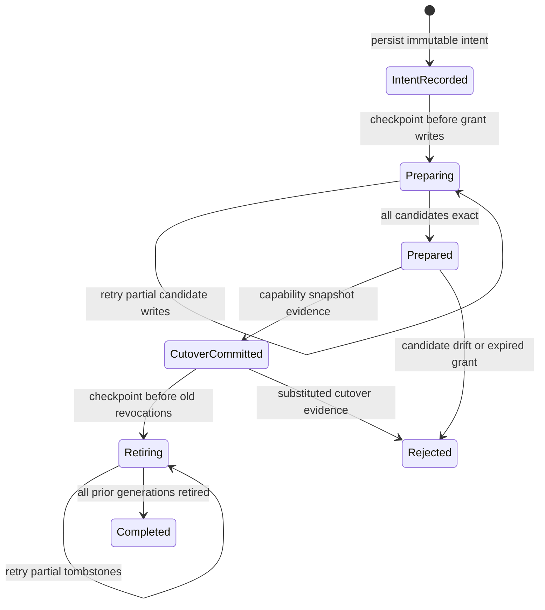

# A3S Use Plugin Platform Architecture

- Status: accepted target architecture; implementation in progress
- Planning baseline: 2026-07-30
- Roadmap: [A3S Use Plugin Platform Roadmap](../ROADMAP.md)
- Delivery plan: [Plugin Platform Development Plan](plugin-platform-development-plan.md)
- Operations: [Plugin Lifecycle and Security](plugin-platform-lifecycle-and-security.md)
- Runtime decision: [ADR-001: Host-Owned Plugin Runtime Broker](adr-001-plugin-runtime-broker-boundary.md)

This document defines the target architecture for installing and operating an
immutable plugin that may contribute Skills, executable Tools, standard MCP
servers, and sandboxed UI. It refines the roadmap; the roadmap remains the
source of truth for delivery status and priority.

## Executive Decision

A plugin is one signed, immutable package and one lifecycle aggregate. Its
surfaces are not copied into unrelated ownership roots and are not activated
independently.

A3S Use stores the canonical package, records desired state, and reconciles
each declared surface into the host that owns its execution:

| Surface | Meaning | Activation target |
| --- | --- | --- |
| Skill | Instructions and supporting content | A managed Skill projection or session Skill registry |
| Tool Task | A non-interactive CLI program used to perform real work | An A3S Runtime Task, or a constrained legacy native runner |
| Tool Service | A private HTTP service used to perform real work | An A3S Runtime Service behind a scoped binding |
| MCP | A standard MCP server, distinct from a Tool | Runtime Service for Streamable HTTP; supervised session for stdio |
| UI | Integrity-bound static HTML, CSS, and JavaScript | A3S Code/Web sandbox with declared backend bindings |

In this architecture, **Tool does not mean an MCP `tools/list` item**. A Tool
is a workload on which a Skill or UI can depend. It keeps its native CLI or
HTTP contract. A3S Use does not translate it into a private tool protocol or a
universal action schema.

Static UI is not a Runtime workload. Only a UI's declared Tool or MCP backend
is deployed through Runtime.

## Architectural Drivers

The design optimizes for:

1. metadata-only discovery and payload-on-demand installation;
2. one identity, trust decision, generation, and uninstall boundary for all
   package surfaces;
3. safe user and policy-authorized agent lifecycle operations;
4. atomic capability publication even though package storage, Runtime, and
   Code/Web do not share a database transaction;
5. exact-generation routing and in-flight-call draining;
6. provider-neutral execution with explicit capability negotiation;
7. diagnosable partial failure and crash recovery;
8. no ambient authority from Skill text, UI content, CLI arguments, or remote
   service responses; and
9. compatibility with existing extension schema v1/v2 packages.

The design does not make Runtime a package manager, make A3S Use a scheduler,
or invent another agent RPC protocol.

## System Boundaries

```text
                         signed registries
                    metadata index + package target
                                |
                         Plugin Catalog
                   verify / search / resolve / cache
                                |
 user CLI/Web ----> Plugin Manager <---- management MCP ---- agent
                         plan / apply
                                |
                    Policy and Grant Broker
                                |
                  Package Store + Operation Log
                                |
                      Surface Reconciler
             +----------+----------+-----------+
             |          |          |           |
         Skill host  Tool broker  MCP host   UI host
             |          |          |           |
             |       A3S Runtime --+       Code/Web sandbox
             |       Task/Service
             +----------+----------+-----------+
                                |
                 atomic Capability Snapshot
                                |
                       active A3S sessions
```

The control plane resolves, authorizes, installs, and reconciles desired state.
The data plane executes a Tool, serves MCP, renders UI, or supplies Skill
instructions. A data-plane surface cannot mutate plugin lifecycle state.

### Ownership

| Component | Owns | Does not own |
| --- | --- | --- |
| Umbrella A3S host | Registries, trust roots, confirmation, ACL policy, workspace grant decisions | Package extraction, grant-record I/O, or surface execution |
| A3S Use | Package validation, receipts, grant-record persistence, desired state, reconciliation, bindings, leases, capability publication | Policy authority, Runtime provider internals, or plugin API vocabulary |
| A3S Runtime | Digest-bound Task/Service execution, observation, stop, remove, logs | Plugin resolution, provider selection, Skill/UI projection |
| A3S Gateway | Private endpoint routing and scoped access to Service bindings | Package lifecycle or permission grants |
| A3S Code/Web | Session projection, managed Skill roots, sandboxed UI | A second package manager |
| Plugin publisher | Surface implementation, manifest, release descriptors, provenance | User policy or host authority |

## Domain Model

### Stable identities

| Entity | Identity |
| --- | --- |
| Plugin | `<publisher>/<name>` |
| Plugin release | Plugin ID + semantic version + package digest |
| Installed generation | Plugin release + monotonically increasing activation generation |
| Surface | Plugin ID + surface kind + manifest-local surface ID |
| Runtime binding | Installed generation + surface ID + explicit provider ID |
| Workspace grant | Workspace + package digest + permission digest |
| Operation | Random operation ID + canonical plan digest |

A route, command alias, display name, endpoint, filesystem path, and Runtime
unit ID are projections. None is an ownership identity.

### Plugin aggregate

The aggregate contains:

- one immutable manifest and package digest;
- zero or more named Skills;
- zero or more named Tool Tasks or Tool Services;
- zero or more named MCP servers;
- zero or more named UI contributions;
- an acyclic dependency graph among those surfaces;
- package-level permission ceilings;
- compatibility requirements and exact external release dependencies; and
- one desired activation state per workspace scope.

A Skill may require Tools and MCP surfaces. A UI may bind to Tool Services or
MCP surfaces. Required dependencies must belong to the same immutable plugin
generation unless the package resolver pins an external plugin release by
version and digest.

All declared surfaces are required by default. A publisher may explicitly mark
a surface optional, but any optional surface referenced by a required Skill or
UI becomes part of the required readiness closure. Failure outside that closure
produces `degraded`; failure inside it blocks atomic activation.

### Desired and observed state

Desired state is deliberately small:

```text
absent | installed-disabled | enabled
```

Observed state is evidence, not authority:

```text
unresolved | staging | installed | reconciling | ready
degraded | broken | draining | removing | removed
```

Each surface also reports `pending`, `prepared`, `starting`, `healthy`,
`failed`, `draining`, or `stopped`. Plugin `ready` means every enabled,
required surface has satisfied its surface-specific readiness gate. It must
never be inferred merely from an enabled receipt.

## Package Contract

### Package granularity

A package should be the smallest independently useful trust, permission,
upgrade, and uninstall unit. A large collection such as Science should publish
separate catalog packages when its data-source Tools can be selected
independently. A no-payload metapackage may depend on a reviewed set for users
who want the complete collection.

Shared binaries, images, models, and data are exact content-addressed
dependencies. The resolver may deduplicate their bytes, but it must not merge
the ownership, grants, or lifecycle of the plugins that consume them. Search
and inspect fetch metadata only; install downloads the selected package and its
exact dependency closure, not the entire publisher catalog.

### Immutable layout

The canonical package remains under a content-addressed A3S Use root:

```text
plugins/<publisher>/<name>/<version>-<digest>/
  a3s-use-extension.acl
  skills/
  tools/
  mcp/
  ui/
  releases/
  provenance/
```

Directories are illustrative; manifest paths are authoritative. Every path is
package-relative, canonicalized, bounded, and digest-verified. Links, device
files, traversal, duplicate archive paths, and case-folding collisions fail
closed.

The filename `a3s-use-extension.acl` and schema v1/v2 remain readable during
migration. The target schema v3 adds named, repeatable surfaces. Internally the
domain type is `PluginManifest`; changing the on-disk filename is unnecessary
until a separately versioned migration provides material value.

### Illustrative schema v3

```acl
extension "acme/research" {
  schema_version = 3
  version        = "2.0.0"
  route          = "research"
  requires_use   = ">=0.3.0, <0.4.0"
  actions        = ["read", "mutate"]

  repository {
    url      = "https://github.com/acme/research"
    revision = "0123456789abcdef0123456789abcdef01234567"
  }

  tool "convert" {
    workload      = "task"
    interface     = "cli"
    executable    = "tools/convert/bin/convert"
    command       = "acme-convert"
    json_output   = true
    interactive   = false
    timeout_ms    = 120000
    activation    = "lazy"
  }

  tool "index" {
    workload          = "service"
    interface         = "http"
    release           = "releases/index-tool-v1.json"
    base_path         = "/api"
    contract          = "tools/index/openapi.json"
    activation        = "eager"
  }

  mcp "library" {
    release   = "releases/library-mcp-v1.json"
    transport = "streamable-http"
  }

  skill "review" {
    path          = "skills/review/SKILL.md"
    requires_tool = ["convert", "index"]
    requires_mcp  = ["library"]
  }

  ui "review" {
    entry     = "ui/review/index.html"
    skill     = "review"
    bind_tool = ["index"]
  }
}
```

The checked-in
[`plugin-v3.acl`](../crates/extension/fixtures/manifests/plugin-v3.acl)
fixture is the executable contract and carries an adjacent stable SHA-256
golden. The fixture bytes use LF endings and include the final repository
newline in their digest.

This example records deployment and binding facts, not the Tool's business
operations. The CLI owns its arguments and exit codes. The HTTP service owns
its routes and response schemas. An optional content-bound OpenAPI document is
documentation and validation evidence, not a new A3S execution protocol.

### Release descriptors

Existing [`a3s.use.mcp-release.v1` and
`a3s.use.skill-release.v1`](release-descriptors.md) remain the canonical
hosted MCP and Skill release boundaries.
[`a3s.use.tool-release.v1`](release-descriptors.md#tool-v1) uses the same
canonical JSON, provenance, compatibility, dependency, artifact-digest, and
size rules. Its checked-in Task and Service fixtures are the cross-SDK
contract goldens.

The Tool descriptor adds exactly one workload contract:

- Task + CLI: process entrypoint, non-interactive execution, timeout, output
  bounds, and exit semantics;
- Service + HTTP: named port, private network mode, base path, health check,
  startup deadline, graceful shutdown, and optional API contract digest.

Secrets, mutable tags, provider configuration, endpoint URLs, and plaintext
environment values are deployment policy and must not enter a release
descriptor.

## Surface Reconciliation

The Surface Reconciler is the architectural center of the system. It consumes
an immutable package generation, desired state, grants, and Runtime provider
capabilities. It produces per-surface bindings and one atomic capability
snapshot.

Reconciliation is level-based and idempotent:

```text
observe current package, grants, bindings, Runtime units, and projections
  -> calculate desired surface graph
  -> validate dependency and provider requirements
  -> apply or repair individual bindings
  -> wait for required readiness
  -> publish one new capability generation
  -> drain and garbage-collect superseded bindings
```

It never treats a successful process spawn as readiness and never silently
changes provider after a plan was approved.

### Surface placement

#### Skill

The Skill remains canonical inside the package root. Its entrypoint and
supporting files are verified before projection.

The preferred projection is a capability-registry entry that lets A3S Code add
the immutable package Skill root to a session. A host that requires a physical
`skills/` directory receives a receipt-owned, generation-scoped projection and
an atomic root switch. The user's hand-managed Skill directory is not the
canonical package store and is never modified without an explicit host
adapter.

A Skill is published only after every required Tool and MCP binding is
prepared or healthy. Skill text cannot add dependencies or permissions.

#### Tool Task

A Tool Task is a real CLI workload. New portable packages should map it to
`RuntimeUnitClass::Task`. Each invocation binds the exact package generation,
preserves native `argv`, stdout, stderr, and exit status, enforces resource and
time limits, and produces an auditable invocation ID.

A managed command shim may be projected into a session-specific `bin/`
directory. The shim resolves only its declared plugin and Tool ID through the
Tool Binding Broker; it never accepts an arbitrary executable path. The
package executable itself is not copied into a global binary directory.

The canonical command name should be publisher-qualified. A short alias is a
scope-local projection that must be conflict-checked during planning. A new
generation cannot replace an alias owned by another plugin.

Existing package-relative native CLI surfaces use a compatibility runner until
a selected Runtime provider supports their artifact media type. They are
reported as `native-unconfined` wherever filesystem, process, environment, and
network restrictions are not actually enforced. Such a Tool cannot use the
unattended agent-allow path.

#### Tool Service

A Tool Service maps to `RuntimeUnitClass::Service`. It is deployed from a
digest-pinned artifact, must pass its declared health contract, and binds only
to a private Runtime network. A3S Gateway publishes a scope-local endpoint
reference after authorization; Runtime does not expose a mutable public port.

The Binding Broker resolves that endpoint for an authorized session. Agents
use the Tool's documented HTTP API, and a bound UI receives an origin-scoped
reverse-proxy path. Neither receives provider credentials or a direct Runtime
control token.

#### MCP

Streamable HTTP MCP maps to a Runtime Service and uses the existing immutable
MCP release descriptor. Readiness requires both declared HTTP health and a
successful standard MCP initialize/probe.

Stdio MCP remains a supervised session surface for Runtime v0.2 because its
`exec` operation is unary and non-interactive; it cannot preserve a long-lived
stdin/stdout protocol. It may move to Runtime only after Runtime exposes an
explicit bidirectional session contract. It must not be emulated through
repeated `exec` calls.

MCP `tools/list` results are capabilities of the MCP surface. They are not
Plugin Tool surfaces and are not written into the package manifest as Tool
workloads.

#### UI

UI assets stay in the immutable package and are served by Code/Web from a
digest-bound generation on a unique sandbox origin. The iframe has no ambient
host DOM, filesystem, network, secret, or lifecycle authority.

A UI may bind only to dependencies declared in its manifest. A Tool Service
binding is exposed as a same-origin, path-scoped reverse proxy; MCP interaction
uses the host's existing reviewed bridge. Removing or upgrading the plugin
revokes the binding before its old assets are collected.

## Workspace Permission Grants

The signed package permission record is a ceiling, not an activation grant.
The canonical `a3s.use.plugin-workspace-grant.v1` contract binds one workspace,
package ID and digest, signed ceiling digest, resolved permission digest,
policy digest, actor, decision, confirmation evidence, grant time, and optional
expiry. It contains no secret values.

Resolved permissions reuse the typed permission shape and can only narrow the
signed ceiling. Filesystem grants must stay under an allowed scope/path and
cannot upgrade read to read-write. Network hosts remain exact and ports can
only be removed. Resource values can only decrease. Native execution,
child-process authority, private Service exposure, and secret names cannot be
added. UI methods and path prefixes can only narrow a declared Tool binding.

Secret-bearing grants require an explicit `ask` decision confirmed by a user.
An agent grant cannot carry secret authority. Canonical grant and permission
digests can be included directly in operation-plan workspace impacts and
Runtime semantics evidence.

Grant authorization has a two-phase digest graph:

```text
resolved permissions + policy
  -> canonical grant proposal
  -> immutable operation plan binds proposal digest
  -> user confirmation binds plan digest + proposal digest
  -> deterministic final grant binds confirmation digest
```

The proposal contains no premature confirmation claim. `allow` finalizes at
trusted apply time without confirmation; `ask` requires an exact, in-window
user confirmation record. This prevents the circular construction that would
result if a pre-confirmation plan tried to contain the digest of a final grant
whose own digest includes later confirmation evidence.

The existing operation-plan workspace impact carries two aggregate references:
`grantBeforeDigest` is the canonical active-grant snapshot, while
`grantAfterDigest` is the canonical sorted multi-package change set. The latter
contains exact before evidence and/or after proposals per package. Validation
derives the required package keys and sides from Add, Replace, and Remove
transitions for root plus dependencies. Retained packages are no-op; an
injected, missing, reordered, stale, or generation-mismatched entry fails
closed.

Construction follows the same rule through `PluginWorkspaceGrantPlan`: one
exact host binding, state revision, sorted package transition set, and complete
scope snapshot deterministically produce the canonical change set plus its
workspace impact. The builder always binds the snapshot, even when it is empty,
and returns no grant plan for permission-free or disabled transitions. Runtime
authorization selects its package proposal from this validated multi-package
plan rather than accepting an unrelated proposal.

One plan-level operation confirmation authorizes an `ask` apply, including a
revoke-only operation. Each new proposal confirmation must refer to the same
plan and confirmation time. Resolution returns candidate grants for the
prepare phase and exact prior grant evidence for retirement after capability
cutover. Both share `stateRevision + 1`, but their side effects remain ordered
by the lifecycle saga rather than pretending to be one filesystem transaction.

Durable grant state is stored separately from package receipts at
`<state-root>/grants/<scope-sha256>/<publisher>/<package>/<package-sha256>.json`.
Each bounded record is either a revisioned
`a3s.use.plugin-workspace-grant-receipt.v1` receipt or an
`a3s.use.plugin-workspace-grant-revocation.v1` tombstone that binds the exact
prior receipt. Writes use a cross-process lock, durable atomic replacement,
strict path and symlink checks, monotonic revision/time transitions, and
exact-ownership revocation.

The planning adapter snapshots a scope by traversing those records while
holding the same cross-process lock used by writers. It validates every
publisher, package, and generation path, enforces fixed traversal and active
entry bounds, rejects a requested global revision older than either a grant or
revocation tombstone, and orders evidence by package ID. Multiple granted
generations for one package indicate an incomplete lifecycle transition; the
snapshot fails closed until saga recovery retires the old or failed candidate
generation. Atomic-write temporary files are never authorization evidence.

The package digest is part of the storage key rather than only a field in one
mutable package record. This permits N and candidate N+1 grants to coexist
during blue/green preparation. A grant does not publish a capability: the
scope-aware capability snapshot still selects the one visible generation.
After the capability snapshot switches and leases drain, the old generation
receives a revocation tombstone. ACL policy evaluation and plan-to-grant
resolution remain separate lifecycle steps.

Grant transitions have their own durable sub-saga. Before writing a candidate,
the adapter locks the store, regenerates the current scope snapshot, compares
the planned digest when present, and writes an immutable operation journal. The
journal includes exact old receipts as well as new receipts and ceilings, so
recovery does not depend on an in-memory plan. Preparation may leave N and N+1
granted, which intentionally blocks unrelated planning as unstable. The
capability publisher then supplies
`a3s.use.plugin-workspace-grant-cutover.v1` evidence binding the expected
generation pair and published snapshot digest. Only a journal with that
durable evidence may enter retirement.



For a same-package, same-generation permission replacement, preparation
atomically supersedes the prior receipt and retirement verifies the new receipt
instead of writing a tombstone over it. For a new package digest, N remains
granted until cutover evidence exists and is then tombstoned exactly. The
cross-sub-saga binding now coordinates the grant and Runtime child gates around
one capability publication; the shared Plugin Manager still needs to persist
and invoke that contract with package, route, and lease-drain checkpoints.

## Runtime Integration

Runtime is injected through a typed `RuntimeClient`; A3S Use must not construct
or infer a backend name from a string in a package.

The normative composition boundary is the host-owned
[Plugin Runtime Broker](adr-001-plugin-runtime-broker-boundary.md). A3S Use
produces provider-neutral templates from signed package evidence; the
umbrella CLI, Desktop/Web host, or Cloud node supplies configured provider
assignments and clients. A package cannot register a provider. A local OCI
component is not an `a3s-runtime` provider unless a host adapter implements the
typed factory/client contract and passes provider conformance.

Provider selection occurs during planning:

1. derive required artifact media type, unit class, isolation, network, mount,
   health, resource, secret-reference, and lifecycle capabilities;
2. intersect them with host policy and configured provider capabilities;
3. choose one explicit provider through host policy;
4. record provider ID, build evidence, and capability digest in the plan; and
5. reject apply if that evidence changes incompatibly.

There is no silent fallback. A provider failure is surfaced as a typed
per-surface failure.

The implemented `RuntimeProviderSelector` accepts one explicit assignment per
Runtime-backed surface. It rejects duplicate assignments before connecting,
connects only those provider IDs through `RuntimeClientRegistry`, validates
the complete Runtime spec plus required lifecycle features, and returns both
sorted immutable plan evidence and the exact client selected for later
prepare/apply. Provider choice remains host input; package metadata cannot
name or prioritize a provider.

Executable planning now has a metadata-only path. Catalog v3 binds the exact
small `planning-v1.json` TUF target. The bundle carries complete immutable
Tool Task, Tool Service, or Streamable HTTP MCP release/artifact evidence.
`plan_runtime_bundle` converts that evidence and a canonical
pre-confirmation grant proposal into Runtime templates.
`plan_runtime_bundle_with_authority` also accepts process-local
`RuntimeAuthorityBindings`. The binding set must exactly cover every reviewed
filesystem permission and secret name and must match the explicit provider
assignment: plugin-data/workspace permissions map to distinct host-owned
Runtime Volumes, temporary permissions map to bounded Tmpfs, and secret names
map to scheme-qualified opaque provider references with unique typed delivery
targets. Logical paths become deterministic container targets under
`/a3s/plugin-data`, `/a3s/temporary`, or `/a3s/workspace`; no host path enters
the plan.

`RuntimeAuthorityResolverRegistry` supplies the host composition boundary for
those bindings. It registers one resolver per explicit Runtime provider, has
no default or fallback, and resolves all affected surfaces under one deadline
of at most 60 seconds. Each planning-only request binds scope, package and
permission digests, qualified surface, generation, provider, reviewed logical
filesystem permissions, secret names, and the ephemeral-storage ceiling.
Resolver source errors are redacted, and all returned resources are
independently revalidated for exact coverage, source kind, uniqueness, bounds,
and provider identity. The Broker retains the result across both provider
passes, and the Runtime semantics digest binds the resulting non-secret spec.
Concrete CLI/Web/Cloud hosts still supply their provider-specific resolver
implementations.

Exact host/port egress allowlists, child-process denial, and native confinement
are not representable by Runtime 0.2. Those permissions continue to fail
closed; generic outbound networking or a PID limit is not treated as
equivalent enforcement.

The Runtime unit uses a deterministic unit ID and a monotonic Runtime
generation. Its semantics-profile digest binds at least:

```text
package digest
+ surface descriptor digest
+ permission/grant digest
+ non-secret Runtime spec
+ compatibility contract version
```

The runtime-binding receipt records provider ID/build, capability and
enforcement evidence, unit ID, generation, spec digest, endpoint reference,
Runtime start identity, observation revision, and last healthy time. It never
records bearer tokens or secret values.

The initial M5 adapter implements that boundary against the
compatibility-locked Runtime 0.2 contract. A resolved artifact is accepted only
when its digest and media type exactly match the signed release descriptor.
Provider ID, provider build, a normalized capability digest, enforcement
profile, and semantics-profile digest are rechecked immediately before prepare
or apply. Runtime 0.2 at the locked revision does not publish a portable
Service socket, so a converged Service and its Gateway route remain two
separate facts. The binding receipt accepts only an opaque `gateway:` reference
and never a raw URL or credential.

The adapter intentionally fails closed on Task success-exit-code sets other
than `[0]`; the locked Runtime observation does not expose an exit code from a
Task apply. It also does not make an MCP Service ready merely because its
process is healthy. Standard MCP initialization and durable binding
reconciliation are additional gates.

Task provider evidence is computed from a launcher template: artifact,
entrypoint, resource and isolation policy, mounts, secret references,
non-secret environment, and native output contract. Invocation ID and argv are
excluded from that install-time semantics digest and remain bound by each
individual Runtime unit spec digest. This allows one reviewed Task binding to
serve multiple native CLI invocations without authorizing a different
launcher.

Non-secret Task and Service receipts are persisted under
`state/bindings/runtime`. Scope IDs are hashed for path ownership; package and
surface segments remain validated identities. Writes use a cross-process lock,
bounded temporary file, durable atomic replacement, monotonic generation and
Service observation checks, and exact-current removal. A Streamable HTTP MCP
receipt is structurally invalid unless it contains initialize evidence for the
release-declared protocol version after the Runtime observation.

The implemented MCP initializer uses the standard RMCP Streamable HTTP client,
not a synthetic readiness flag. The host supplies a non-serializable
connection that joins the opaque Gateway reference to the exact Runtime unit,
generation, and start identity. Bearer and URL material is redacted and never
enters a receipt. HTTP is restricted to loopback; a remote Gateway must use
HTTPS without URL credentials, queries, or fragments. The bounded probe sends
the signed release protocol, rejects any negotiated downgrade or substitution,
closes the temporary MCP session, and emits evidence only after successful
cleanup. A process restart invalidates the connection before the handshake and
invalidates its eventual receipt during live observation.

Binding transitions use a second bounded journal beneath
`state/bindings/runtime/.operations/<scope-sha256>/<operation-sha256>.json`.
The immutable intent binds the host operation and plan, optional scope
grant-change set, before/after state revision, before/after capability
generation, exact candidate plans, and exact prior receipts. Candidate
receipts are recorded without making them active. The `publishing` checkpoint
precedes active multi-surface receipt replacement, so a partial write can
replay from the journal. Only after all active receipts match may the journal
accept the Runtime cutover derived from the parent capability publication.

The binding phases are `intent-recorded`, `preparing`, `prepared`,
`publishing`, `bindings-published`, `cutover-committed`, `retiring`, and
`completed`. Old bindings remain exact retirement evidence until cutover.
Service retirement requires the matching typed Runtime unit-removal receipt;
Task launcher retirement requires trusted post-cutover time. A same-surface
upgrade verifies that the new active receipt remains exact while checkpointing
removal of the old Service generation. Uninstall removes only the exact prior
active receipt, and recovery accepts an already absent receipt only after the
journal has entered retirement.

The host-owned cross-sub-saga boundary is
`PluginLifecycleOperationBinding`. It rebinds the reviewed plan to the exact
scope-specific grant and Runtime intent digests, validates complete
Runtime-surface/provider coverage, and requires every grant child at
`prepared` plus every Runtime child at `bindings-published` before
publication. The child journal path includes both scope and operation so one
user-scoped parent operation cannot alias two workspaces.

The host publishes one immutable capability snapshot, then records
`PluginLifecycleCutoverEvidence`. That record binds the parent binding digest,
before/after state and capability generations, snapshot digest, and trusted
commit time. It independently derives exact grant and Runtime child cutovers,
including a Runtime child for a scope with no grant child, and the completion
gate verifies every child reached `completed` with that same publication.
Partial child commit followed by host or process restart is therefore a normal
idempotent replay state. The umbrella Plugin Manager remains the durable
parent owner; A3S Use does not create a second parent journal.

Task invocation resolves one prepared binding, reconstructs a spec with the
caller's native argv, rechecks the exact provider evidence, and applies one
finite Runtime Task. Terminal success is required before stdout and stderr are
read independently through the Runtime log contract. The compatibility
collector remains limited to 16 MiB per stream and rejects larger bounds before
apply. The streaming path accepts the canonical release ceiling of 1 GiB per
stream and writes to caller-owned async sinks; the trusted host may choose
files without exposing their paths to package, plan, or receipt data. Log
stream identity, sequence, and cursor progress are validated. Writes honor
backpressure, truncation preserves UTF-8 boundaries, and the result reports
bytes and truncation independently for stdout and stderr. Runtime 0.2 does not
report the process exit code on Task apply, so only the already-frozen `[0]`
success set is accepted and a successful observation is reported as exit code
zero.

Every terminal Task invocation is removed after its captured output has been
read and the sinks have flushed. If apply fails ambiguously, a provider
violates the finite-Task contract, a sink fails, or Runtime returns mismatched
evidence, the adapter attempts bounded cleanup and exact-generation removal.
Cleanup failure is recorded alongside, but does not replace, the primary typed
invocation or output error.

Live Service observation rechecks provider/build and capability evidence plus
unit ID, generation, spec digest, Runtime start identity, and health. A
same-generation process restart invalidates the previous Gateway endpoint and
MCP initialize evidence instead of silently reusing them. Drain/removal uses
the receipt's explicit provider and exact unit generation. Cleanup may proceed
after that provider's build changes, because refusing to remove an owned
workload would leak authority; new apply and active projection still require
exact reviewed provider evidence.

The Task and Service binding schemas are `a3s.use.runtime-task-binding.v2` and
`a3s.use.runtime-service-binding.v2`. The v2 boundary adds explicit enforcement
evidence and, for Services, Runtime start identity. Earlier development
receipts are not reinterpreted with inferred defaults; they fail closed and
must be prepared and rebound again.

`RuntimeSurfaceObserver` converts persisted binding evidence into one
explicitly scoped Runtime surface snapshot. The caller supplies a canonical
package digest and the Runtime provider registry. For every release-backed
Tool Task, Tool Service, and Streamable HTTP MCP surface, the observer reads
the exact scope/package/surface receipt, rejects package-generation, workload
class, or Tool Service path drift, connects only the receipt's provider, and
performs the live checks above. It never scans or adopts an unknown Runtime
unit.

Reconciliation schema 2 merges that snapshot with disjoint host observations.
Ownership is derived from the manifest workload, not selected by the reporting
adapter: release-backed Tool Tasks, Tool Services, and Streamable HTTP MCP are
Runtime-owned; package-executable Tool Tasks, stdio MCP, Skills, and UI belong
to their corresponding hosts. No receipt produces no explicit Runtime
observation and therefore remains `pending`; a live missing, failed, or stale
binding fails readiness and cannot publish dependent Skills. Two adapters
reporting the same surface is a contract error, including when the Runtime
surface is currently unbound.

For planner consumption, a plan-ready schema-v3 capability binding also
projects `plannerEvidence` schema 1. It binds the canonical extension receipt,
verified catalog record, signed manifest, expanded package, desired enabled
state, and exact sorted named-surface inventory. Catalog/manifest inventory
drift or a dependency-open selection fails the capability snapshot instead of
letting the planner infer state.

The existing process-wide capability snapshot has no workspace identity and
therefore does not select one implicitly. Scope-aware callers use
`CapabilitySessionSnapshotBuilder` with one canonical
`CapabilitySessionObservations` envelope. Every host observation binds the
explicit scope envelope, package ID, immutable package digest, named surface,
manifest-derived owner, and state. The builder gathers Runtime evidence from
only that scope and each receipt's recorded provider, requires explicit Skill
host evidence, and rechecks the extension registry before publication.
Unknown packages, generation drift, owner substitution, and adapter collision
fail closed. The session revision covers scope, capabilities, all host
observations, and exact Runtime provider/generation observations; the registry
generation remains a separate monotonic cutover coordinate.

For named stdio MCP, `StdioMcpSupervisor` is the compatibility-session
boundary. It consumes a registry-owned package lease instead of reopening an
executable by path, revalidates the exact workspace grant, and creates
`a3s.use.stdio-mcp-session-plan.v1`. The plan binds receipt/catalog/manifest/
package identities, grant revision/authority/expiry, the named MCP permission,
disjoint host roots, executable and argv, sanitized environment, lifecycle and
grant-recheck timing, and one explicit provider build/capability digest.

The injected provider owns any claimed OS confinement, process creation,
stderr draining, and provider-owned process-unit cleanup. Use owns a 4
MiB-bounded standard RMCP initialize exchange, exact process/transport
liveness, typed live authorization observations, capability-host
observations, and the package lease. It checks the exact durable grant after
spawn and at the plan-bound interval; expiry, revocation, replacement,
disappearance, or observation failure terminates the process and blocks new
calls. The lease is held by a detached settler until exact terminal provider
evidence, including after a session handle is dropped, shutdown times out, or
a provider wait returns an error. Wait failures trigger termination and retry
rather than releasing the generation. `native-unconfined` requires explicit
user confirmation; a sandbox provider must advertise exact filesystem,
network, child-process, and resource enforcement. No built-in raw process
spawn is treated as enforcement, and secret-bearing stdio surfaces remain
unavailable until a typed host secret-reference resolver exists.

`NativeUnconfinedStdioMcpHost` supplies the production native path with
immutable OS/architecture/build evidence. It revalidates canonical,
non-aliased roots and a package-owned executable, clears the ambient
environment, preserves native argv and exact package-root cwd, continuously
drains stderr, and owns a POSIX process group or Windows Job Object through
termination and reap. This is compatibility lifecycle ownership, not sandbox
confinement: on POSIX a deliberately daemonizing child can escape its process
group. A production sandbox provider remains necessary for adversarial
filesystem, egress, child-process, and resource enforcement.

Current provider evidence matters:

- the Cloud Docker provider supports Task and Service, service networking, and
  HTTP/TCP/command health checks, so it can host HTTP Tool and MCP Services;
- the current Box Runtime driver advertises Task and Service but only
  `NetworkMode::None` and no health checks, so it cannot honestly host an HTTP
  Tool or Streamable HTTP MCP Service yet; and
- package-relative native binaries need either a compatible content-bundle
  provider or the explicitly constrained legacy runner.

## Binding Model

Bindings decouple immutable package identity from mutable locations:

```text
SkillBinding  -> verified root + entrypoint digest
TaskBinding   -> provider + artifact + launcher reference
HttpBinding   -> provider + private endpoint reference + gateway scope
McpBinding    -> transport + endpoint/session factory + protocol version
UiBinding     -> sandbox origin + declared backend binding IDs
```

Bindings are workspace- and generation-scoped. A session receives an immutable
snapshot and a lease. An invocation resolves the binding again before starting
so a revoked route cannot accept new work. An accepted invocation retains its
exact generation until completion or bounded cancellation.

The Tool Binding Broker performs binding and authorization only. It does not
parse a CLI into actions, reinterpret an HTTP API, convert a Tool into MCP, or
allow arbitrary package-path execution.

Projection also checks the session's carrier capabilities. A CLI Tool requires
the host's managed process runner, an HTTP Tool requires a scoped HTTP client,
MCP requires a compatible MCP client, and UI requires the sandbox host. A Skill
whose required carrier is absent is not projected into that session.

## Operational Model

The normative lifecycle saga, crash recovery, permission model, storage
layout, public contracts, and observability rules are defined in
[Plugin Lifecycle and Security](plugin-platform-lifecycle-and-security.md).

The core invariants are:

- persist intent before external side effects;
- publish one capability generation only after its required dependency closure
  is ready;
- keep generation N active until N+1 passes all gates;
- revoke new routes before draining and removing workloads;
- bind every grant and Runtime observation to exact content digests; and
- retain mutable user data unless a separate purge is authorized.

The first live complete-plan slice is implemented for catalog-v2 installs that
contain only permission-free Skill and UI surfaces. The umbrella component plan
retains the verified catalog record, the shared Manager joins it to the exact
registry target and verified capability snapshot, and host binding adds policy
authority. A durable monotonic planner revision detects state drift between
review and apply and advances idempotently after successful child mutation.
The same safe slice now covers registry upgrade and uninstall by joining the
package-specific installed catalog and receipt to the compact capability
snapshot and umbrella current version, then deriving exact replace or remove
transitions.

For executable candidates, catalog v3, the separately signed planning bundle,
TUF target-only loading, provider-neutral Runtime templates, and CLI
component-plan transport are implemented. The process-local Runtime Broker now
performs capability preflight and grant-proposal-bound final selection while
retaining the exact provider clients and rejecting evidence drift. The shared
Manager revalidates that the typed bundle matches the exact catalog evidence.
Executable or permission-bearing drafts still fail closed until the host
injects that Broker and connects policy, workspace grant changes, and the
durable lifecycle saga.

## Compatibility and Migration

Migration is additive:

1. parse schema v1/v2 unchanged and adapt singular `cli`, `mcp`, and `skill`
   fields into named internal surfaces;
2. interpret legacy `cli` as one Tool Task with user exposure and retain its
   existing direct launcher behavior;
3. add schema v3 fixtures for multiple Skills, Tools, MCP servers, and UIs;
4. introduce the Tool release descriptor and Runtime mapping behind typed
   interfaces;
5. move Science to registry-only delivery and model its real executables or
   Services as Tool surfaces;
6. project dependency-ready Skills and UI from the shared reconciler;
7. make CLI, Web, and management MCP use the same Plugin Manager; and
8. deprecate the native compatibility runner only after supported Runtime
   providers pass equivalent Task and stdio-session conformance.

No migration converts a Tool into an MCP server. A publisher may expose both
when both interfaces are useful, but they remain distinct surfaces sharing one
package generation.

## Required Architecture Decisions

Implementation records focused ADRs for decisions that cross repository
boundaries. [ADR-001](adr-001-plugin-runtime-broker-boundary.md) freezes the
Tool/MCP Runtime ownership and provider-selection boundary. Additional ADRs
remain required for:

1. manifest schema v3 and v1/v2 adapter rules;
2. Skill dependency and managed-root projection;
3. private Service endpoint and UI reverse-proxy binding;
4. operation saga, idempotency, and crash reconciliation;
5. workspace grants and global package reference counting; and
6. stdio MCP compatibility and future Runtime session boundary.

## Architecture Acceptance Gates

The architecture is implemented only when:

- one plugin can contain multiple named Skills, Tool Tasks, Tool Services, MCP
  servers, and UIs;
- a Skill is never visible before its required Tools and MCP bindings are
  usable;
- a CLI Tool executes as an exact-generation Task and preserves native process
  semantics;
- an HTTP Tool is private, health-gated, and accessible only through a scoped
  binding;
- Tool workloads are never conflated with MCP `tools/list`;
- UI assets remain static and sandboxed while their backend workloads are
  independently supervised;
- install, upgrade, disable, and uninstall survive a crash at every durable
  step without publishing a partial generation;
- provider insufficiency is diagnosed before apply with no silent fallback;
- upgrade either atomically activates all required N+1 surfaces or keeps N
  active; and
- uninstall removes only receipt-owned package, projection, binding, and
  Runtime resources while retaining user data by default.
