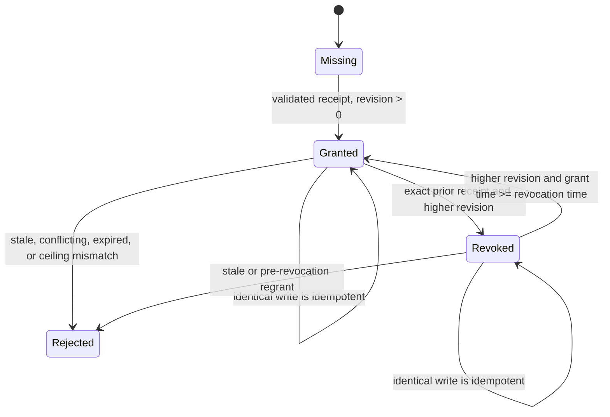

# A3S Use Plugin Lifecycle and Security

- Status: accepted M0 contract baseline; runtime implementation in progress
- Planning baseline: 2026-07-30
- Architecture: [Plugin Platform Architecture](plugin-platform-architecture.md)
- Contracts: [Plugin Contract Reference](plugin-contracts.md)
- Roadmap: [A3S Use Plugin Platform Roadmap](../ROADMAP.md)

This document is the operational companion to the plugin platform
architecture. It defines lifecycle consistency, failure recovery, security,
storage, public application contracts, and observability.

## Complete End-to-End Lifecycle Flow

The following is the normative full lifecycle flow, from metadata-only search
through selective installation, active use, upgrade, disable, uninstall,
retained data, and crash recovery. The same Plugin Manager serves CLI, Web,
and management MCP adapters. Solid arrows are normal transitions. Dotted
arrows represent recovery after durable operation intent has been recorded.

```mermaid
flowchart TD
  actor["User or authorized agent"] --> command{"Requested operation"}

  subgraph discovery["1. Discovery and resolution"]
    catalog["Refresh and search verified metadata<br/>No package payload download"]
    inspect["Inspect provenance, surfaces, permissions,<br/>sizes, compatibility, and withdrawal state"]
    installChoice{"Install selected release?"}
    resolveInstall["Resolve exact package and dependency digests<br/>Action: install"]
    resolveUpgrade["Resolve N+1, permission diff, dependencies,<br/>and provider requirements<br/>Action: upgrade"]
    resolveUninstall["Resolve owned resources, workspace impact,<br/>leases, and retained data<br/>Action: uninstall"]
    buildPlan["Persist canonical expiring plan and allocate operationId<br/>Bind registry root, metadata versions, digests,<br/>scope, grant proposals, provider evidence, and impact"]
  end

  command -- "Search / inspect / install" --> catalog
  catalog --> inspect
  inspect --> installChoice
  installChoice -- "No" --> idle["No mutation"]
  installChoice -- "Yes" --> resolveInstall
  command -- "Upgrade" --> resolveUpgrade
  command -- "Uninstall" --> resolveUninstall
  resolveInstall --> buildPlan
  resolveUpgrade --> buildPlan
  resolveUninstall --> buildPlan

  subgraph authorization["2. Authorization and immutable apply"]
    policy{"ACL policy decision"}
    confirmation{"User confirms the exact plan?"}
    confirmationEvidence["Persist confirmation evidence binding<br/>planDigest + each grant proposal digest"]
    denied["Denied or cancelled<br/>No mutation"]
    apply["Apply with operationId + canonical planDigest"]
    loadPlan["Load the immutable reviewed plan<br/>from the durable manager store"]
    resultExists{"Durable terminal result already exists?"}
    replayResult["Return the same result with replayed=true<br/>No child process or side effect"]
    reresolve["Repeat trust, dependency, permission,<br/>provider, ownership, and impact resolution"]
    exact{"Still exactly matches the plan?"}
    drift["Reject expired or changed plan<br/>Require a new review"]
    finalizeProposals["Deterministically finalize validated grant proposals<br/>No side effect or package-controlled input"]
    intent["Persist durable operation intent<br/>and per-surface idempotency keys"]
    plannedAction{"Planned action"}
  end

  buildPlan --> policy
  policy -- "deny" --> denied
  policy -- "ask" --> confirmation
  confirmation -- "No" --> denied
  confirmation -- "Yes" --> confirmationEvidence
  confirmationEvidence --> apply
  policy -- "allow within every ceiling" --> apply
  apply --> loadPlan
  loadPlan --> resultExists
  resultExists -- "Yes" --> replayResult
  replayResult --> command
  resultExists -- "No" --> reresolve
  reresolve --> exact
  exact -- "No" --> drift
  drift --> command
  exact -- "Yes" --> finalizeProposals
  finalizeProposals --> intent
  intent --> plannedAction

  subgraph packageInstall["3. Package installation or upgrade staging"]
    stage["Download selected package and exact dependency closure<br/>to a bounded staging root"]
    verify["Verify TUF metadata, archive length/digest,<br/>manifest, paths, descriptors, artifacts,<br/>compatibility, and permission ceiling"]
    valid{"All verification gates pass?"}
    rejectPackage["Delete or quarantine staging data<br/>Record typed failure; preserve N on upgrade"]
    commit["Atomically commit immutable package generation<br/>and candidate installed-disabled receipt"]
    grantNeeded{"Planned exact-generation<br/>grant transition?"}
    persistCandidateGrant["Persist validated candidate grant receipt<br/>without replacing N authorization"]
    desiredAfterCommit{"Desired state after commit?"}
  end

  plannedAction -- "install / upgrade" --> stage
  stage --> verify
  verify --> valid
  valid -- "No" --> rejectPackage
  rejectPackage --> completeResult
  valid -- "Yes" --> commit
  commit --> grantNeeded
  grantNeeded -- "Yes" --> persistCandidateGrant
  grantNeeded -- "No" --> desiredAfterCommit
  persistCandidateGrant --> desiredAfterCommit

  subgraph reconcile["4. Surface reconciliation"]
    observe["Observe package, desired state, grants,<br/>bindings, projections, Runtime, and Gateway"]
    graph["Build required surface dependency closure<br/>All surfaces required unless explicitly optional"]
    provider{"Explicit provider still satisfies<br/>artifact, Task/Service, isolation, network,<br/>health, mount, resource, and secret capabilities?"}
    staticVerify["Verify Skill and UI content<br/>and declared dependency references"]
    taskPrepare["For each CLI Tool:<br/>prepare exact-generation Runtime Task binding<br/>or constrained legacy native binding"]
    serviceApply["For each HTTP Tool:<br/>apply private Runtime Service<br/>and wait for declared health"]
    mcpTransport{"For each MCP surface"}
    mcpHttp["Streamable HTTP:<br/>apply Runtime Service, pass health,<br/>then complete standard MCP probe"]
    mcpStdio["stdio:<br/>prepare supervised bidirectional session<br/>and complete standard MCP probe"]
    closure{"Required dependency closure usable?"}
    previous{"Superseded generation N exists?"}
    previousState{"Was generation N active?"}
    keepPrevious["Keep generation N active<br/>Record N+1 failure and remediation"]
    keepPreviousDisabled["Keep generation N installed-disabled<br/>Record N+1 failure and remediation"]
    broken["Withhold or revoke required capabilities<br/>Keep package installed; observed broken"]
    readyBindings["Persist non-secret bindings<br/>and receipt-owned projections"]
    degradedBindings["Persist required bindings only<br/>Record optional-surface failures"]
    projectionReady{"Skill roots, command shims, UI index,<br/>and backend bindings committed?"}
    publishReady["Atomically publish one capability generation<br/>Then drain/remove any superseded generation"]
    publishDegraded["Atomically publish required capabilities<br/>Mark aggregate degraded; retry optional surfaces"]
  end

  desiredAfterCommit -- "installed-disabled" --> installedDisabled["Installed and disabled"]
  desiredAfterCommit -- "enabled" --> observe
  observe --> graph
  graph --> provider
  provider -- "No" --> previous
  provider -- "Yes" --> staticVerify
  provider -- "Yes" --> taskPrepare
  provider -- "Yes" --> serviceApply
  provider -- "Yes" --> mcpTransport
  mcpTransport -- "Streamable HTTP" --> mcpHttp
  mcpTransport -- "stdio" --> mcpStdio
  mcpTransport -- "none declared" --> closure
  staticVerify --> closure
  taskPrepare --> closure
  serviceApply --> closure
  mcpHttp --> closure
  mcpStdio --> closure
  closure -- "Required failure" --> previous
  previous -- "Yes" --> previousState
  previousState -- "Yes" --> keepPrevious
  previousState -- "No" --> keepPreviousDisabled
  previous -- "No" --> broken
  closure -- "All declared surfaces ready" --> readyBindings
  closure -- "Only optional surfaces failed" --> degradedBindings
  readyBindings --> projectionReady
  degradedBindings --> projectionReady
  projectionReady -- "No" --> previous
  projectionReady -- "Yes, complete" --> publishReady
  projectionReady -- "Yes, required only" --> publishDegraded
  publishReady --> ready["Enabled and ready"]
  publishDegraded --> degraded["Enabled and degraded"]

  subgraph use["5. Active use and observation"]
    watch["Session watches capability revision"]
    useRequest["Skill/UI load or Tool/MCP invocation"]
    visible{"Authorized exact-generation binding visible?"}
    rejectUse["Reject new use<br/>disabled, stale, incompatible, or unauthorized"]
    lease["Acquire exact-generation shared lease"]
    surfaceKind{"Surface kind"}
    runTask["CLI Tool:<br/>run one Runtime Task with native argv,<br/>bounded input/output, and exit status"]
    callService["HTTP Tool:<br/>call private Service through scoped Gateway binding"]
    callMcp["MCP:<br/>use standard MCP client and declared transport"]
    loadStatic["Skill/UI:<br/>load verified generation-scoped projection"]
    release["Release lease and record bounded observation"]
    changed{"Health or provider observation changed?"}
  end

  ready --> watch
  degraded --> watch
  keepPrevious --> watch
  command -- "Use installed capability" --> useRequest
  watch --> useRequest
  useRequest --> visible
  visible -- "No" --> rejectUse
  rejectUse --> command
  visible -- "Yes" --> lease
  lease --> surfaceKind
  surfaceKind -- "CLI Tool" --> runTask
  surfaceKind -- "HTTP Tool" --> callService
  surfaceKind -- "MCP" --> callMcp
  surfaceKind -- "Skill / UI" --> loadStatic
  runTask --> release
  callService --> release
  callMcp --> release
  loadStatic --> release
  release --> changed
  changed -- "No" --> command
  changed -- "Yes" --> observe

  subgraph toggle["6. Enable and disable"]
    togglePolicy{"Authorize enable or disable<br/>allow / ask / deny"}
    toggleConfirm{"User confirms?"}
    toggleIntent["Persist durable toggle intent<br/>and idempotency key"]
    toggleAction{"Enable or disable?"}
    setEnabled["Persist desired enabled"]
    setDisabled["Persist desired installed-disabled"]
  end

  command -- "Enable / disable" --> togglePolicy
  togglePolicy -- "deny" --> denied
  togglePolicy -- "ask" --> toggleConfirm
  toggleConfirm -- "No" --> denied
  toggleConfirm -- "Yes" --> toggleIntent
  togglePolicy -- "allow" --> toggleIntent
  toggleIntent --> toggleAction
  toggleAction -- "Enable" --> setEnabled
  setEnabled --> observe
  toggleAction -- "Disable" --> setDisabled

  subgraph remove["7. Disable, uninstall, and retained data"]
    referenceGate{"New protected workspace reference<br/>not covered by reviewed plan?"}
    setAbsent["Persist desired absent"]
    revokeGrant["Persist exact-generation grant tombstone<br/>when a current grant exists"]
    hide["Atomically hide routes and projections<br/>Block new calls"]
    drain["Drain exact-generation leases<br/>or reach reviewed timeout policy"]
    removalAction{"Desired state"}
    stop["Stop eager Tool/MCP workloads<br/>Keep immutable package and data"]
    removeRuntime["Stop and remove Runtime units,<br/>Gateway routes, and endpoint bindings"]
    removeProjection["Remove receipt-owned Skill roots,<br/>command shims, UI indexes, and bindings"]
    removePackage["Remove scope receipt and unreferenced<br/>immutable package generations"]
    retain["Retain plugin data and secret records by default"]
    removed["Absent / removed"]
    purge{"Separate explicit user-only purge?"}
    purgeData["Delete reviewed plugin data and secret records"]
  end

  plannedAction -- "uninstall" --> referenceGate
  referenceGate -- "Yes" --> drift
  referenceGate -- "No" --> setAbsent
  setAbsent --> revokeGrant
  revokeGrant --> hide
  setDisabled --> hide
  hide --> drain
  drain --> removalAction
  removalAction -- "installed-disabled" --> stop
  stop --> installedDisabled
  removalAction -- "absent" --> removeRuntime
  removeRuntime --> removeProjection
  removeProjection --> removePackage
  removePackage --> retain
  retain --> removed
  removed --> purge
  purge -- "No" --> completeResult
  purge -- "Yes, explicitly reviewed" --> purgeData
  purgeData --> completeResult

  subgraph completion["8. Durable completion and replay"]
    completeResult["Persist append-only terminal result<br/>Bind operationId, planDigest, timestamps,<br/>typed outcome, and capability before/after"]
    returnResult["Return operation result<br/>A repeated apply reuses this record"]
  end

  installedDisabled --> completeResult
  ready --> completeResult
  degraded --> completeResult
  keepPrevious --> completeResult
  keepPreviousDisabled --> completeResult
  broken --> completeResult
  completeResult --> returnResult
  returnResult --> command
  idle --> command
  denied --> command

  subgraph recovery["9. Crash recovery and reconciliation"]
    restart["Restart finds incomplete operation"]
    compare["Compare durable intent with package, receipt, grant,<br/>Runtime, Gateway, binding, projection, and lease observations"]
    recoveryCase{"Last durable evidence"}
    cleanStage["Delete bounded staging data<br/>Re-plan if necessary"]
    repairReceipt["Reconstruct or quarantine receipt<br/>from verified immutable package"]
    repairBinding["Inspect exact Runtime unit<br/>Reconstruct binding without adopting unknown units"]
    continueRemoval["Continue route drain, stop, removal,<br/>or generation garbage collection"]
  end

  intent -. "Crash or process restart after durable intent" .-> restart
  toggleIntent -. "Crash or process restart" .-> restart
  setEnabled -. "Restart reconciles desired state" .-> restart
  setDisabled -. "Restart reconciles desired state" .-> restart
  setAbsent -. "Restart reconciles desired state" .-> restart
  restart --> compare
  compare --> recoveryCase
  recoveryCase -- "staging only" --> cleanStage
  cleanStage --> command
  recoveryCase -- "package committed" --> repairReceipt
  repairReceipt --> observe
  recoveryCase -- "Runtime applied / binding missing" --> repairBinding
  repairBinding --> observe
  recoveryCase -- "routes hidden / old generation leased" --> continueRemoval
  continueRemoval --> drain

  classDef stable fill:#e8f5e9,stroke:#2e7d32,color:#1b5e20;
  classDef failure fill:#ffebee,stroke:#c62828,color:#7f0000;
  classDef durable fill:#e3f2fd,stroke:#1565c0,color:#0d47a1;
  classDef runtime fill:#fff8e1,stroke:#f9a825,color:#5d4037;
  class ready,degraded,installedDisabled,removed,keepPrevious,keepPreviousDisabled stable;
  class denied,drift,rejectPackage,rejectUse,broken failure;
  class buildPlan,confirmationEvidence,intent,toggleIntent,commit,persistCandidateGrant,revokeGrant,publishReady,publishDegraded,setEnabled,setDisabled,setAbsent,completeResult,returnResult,replayResult durable;
  class taskPrepare,serviceApply,mcpHttp,mcpStdio,runTask,callService,removeRuntime runtime;
```

The graph has five important invariants:

- a repeated `operationId + planDigest` returns the durable result without
  starting another child process or side effect;
- package installation commits a disabled receipt before any capability is
  published;
- a required Skill is invisible until its Tool and MCP dependency closure is
  usable;
- a stored grant alone never publishes a capability;
- upgrade switches all required N+1 bindings in one capability generation or
  keeps N active; and
- disable or uninstall hides new routes before waiting for existing leases.

## Lifecycle and Consistency

Package storage, Runtime providers, Gateway, and Code/Web cannot participate in
one ACID transaction. Lifecycle therefore uses a durable, idempotent saga with
an operation record and compensating actions.

The durability boundary has two non-overlapping layers:

- the shared Plugin Manager stores immutable reviewed plans, apply intent, and
  terminal results keyed by `operationId`; it owns expiry, replay, adapter
  equivalence, and capability generation/revision evidence;
- the umbrella component lifecycle and A3S Use retain the only side-effect
  checkpoint journals; they own downloads, package commits, receipts, Runtime,
  Gateway, projections, and crash recovery.

The manager record never duplicates per-surface checkpoints. After a crash, it
re-enters the exact umbrella apply command, whose existing component journal
verifies observed state and resumes the saga. This separation keeps one source
of truth for mutations while still making adapter retries idempotent.

### Install and enable

1. Resolve verified metadata, dependencies, provider requirements, and grants.
2. Snapshot active grant evidence, derive the sorted root/dependency change
   set, and bind both digests into the canonical expiring plan.
3. Re-resolve on apply and persist an operation intent before side effects.
4. Download to a bounded staging root and verify archive and surface digests.
5. Atomically commit the immutable package and a disabled receipt.
6. Persist any planned exact-generation grant without replacing another
   package generation's authorization.
7. Record desired `enabled` state and reconcile Tool, MCP, Skill, and UI
   bindings in dependency order.
8. Wait for mandatory Services and MCP probes; prepare lazy Tasks.
9. Atomically publish one capability generation.
10. Mark the operation complete and garbage-collect safe staging data.

If activation fails, the package remains installed but disabled or broken with
typed diagnostics. No partial Skill, command shim, endpoint, MCP route, or UI
generation is advertised as ready.

### Upgrade

Generation N remains active while N+1 is staged and reconciled. Services use a
health-gated blue/green binding. After N+1 is fully ready, one atomic snapshot
switch routes new work to N+1. Generation N drains, stops, and is collected
only after all leases release. N and N+1 grants use separate digest-keyed
records during this interval. A failed N+1 leaves N active and revokes the
candidate grant unless the durable operation remains resumable.

An added permission, secret request, provider requirement, external
dependency, command alias, or public interface is plan drift and requires a
new grant or confirmation.

### Disable and uninstall

Disable first publishes a snapshot without the plugin, then drains invocations
and stops eager workloads. The immutable package and retained data remain.

Uninstall:

1. records desired `absent`;
2. persists an exact-generation grant tombstone when a current grant exists;
3. removes new-call routes and session projections;
4. drains exact-generation leases;
5. stops and removes Runtime units and Gateway bindings;
6. removes receipt-owned shims and projections;
7. removes receipts and unreferenced package generations; and
8. retains plugin data and secrets unless a separate purge is authorized.

Global uninstall is rejected while another protected workspace grant depends
on the release unless the reviewed plan includes that impact.

### Crash recovery

On startup, the reconciler scans incomplete operations and compares durable
intent with package, receipt, grant, Runtime, Gateway, and projection
observations.

| Last durable point | Recovery |
| --- | --- |
| Download only | Delete bounded staging data and retry |
| Package committed, receipt absent | Reconstruct or quarantine from verified manifest |
| Disabled receipt committed | Resume reconciliation without publishing |
| Candidate grant committed, bindings absent | Revalidate the exact plan and resume or tombstone the candidate |
| Runtime unit applied, binding absent | Inspect exact unit and reconstruct binding |
| Binding ready, snapshot absent | Revalidate grants and publish atomically |
| Desired absent, grant still active | Persist the planned exact-generation tombstone before cleanup |
| Snapshot removed, workload running | Continue drain and stop |
| Old generation still referenced | Preserve it and retry garbage collection |

Every external mutation carries an idempotency key derived from operation,
surface, and generation. Recovery never guesses that an unknown provider unit
belongs to the plugin.

## Security Architecture

The integrity chain is:

```text
trusted registry root
  -> signed target metadata
  -> package archive digest
  -> manifest and surface content digests
  -> release descriptor digest
  -> signed permission ceiling
  -> active workspace grant snapshot
  -> canonical workspace grant proposal
  -> sorted multi-package grant change set
  -> immutable operation plan digest
  -> user confirmation digest for ask decisions
  -> finalized workspace grant digest
  -> exact-generation workspace grant receipt
  -> executable or image artifact digest
  -> Runtime semantics digest
  -> binding receipt
  -> capability snapshot generation
```

Breaking any link fails closed.

### Permission model

Permissions are typed ceilings evaluated per package digest, surface,
workspace, and actor:

- filesystem read/write roots;
- network egress domains and private inbound Service exposure;
- child-process and native execution;
- secret names, never secret values;
- CPU, memory, process, storage, execution-time, and output limits;
- UI backend binding and method/path ceilings where configured; and
- user-only destructive operations.

Skill instructions, Tool output, MCP descriptions, OpenAPI text, UI messages,
and catalog descriptions are untrusted content. They cannot create a grant,
change provider selection, add a dependency, or authorize lifecycle mutation.

Secrets are delivered by reference at invocation or Service start. They are
excluded from manifests, descriptors, plans, receipts, binding snapshots,
logs, diagnostics, and UI state.

The initial grant contract is
`a3s.use.plugin-workspace-grant.v1`. It binds the workspace and immutable
package generation to both the signed ceiling and the canonical resolved
permission digest, plus policy/actor/confirmation evidence and optional
expiry. Subset evaluation is structural: filesystem and UI paths may only
narrow, network hosts stay exact, ports/methods/secrets may only be removed,
resource values may only decrease, and boolean authorities cannot change from
false to true. Secret-bearing grants require an explicit user confirmation;
agent grants containing secrets are invalid.

Before persistence, `a3s.use.plugin-workspace-grant-proposal.v1` binds the
operation, exact package generation, resolved permission subset, policy
decision, and review window without claiming confirmation. An `allow` proposal
finalizes at trusted apply time. An `ask` proposal requires a
`a3s.use.plugin-grant-confirmation.v1` record created at the user boundary that
binds the operation ID, immutable plan digest, proposal digest, user actor, and
confirmation time. Finalization rejects plan/proposal substitution, future
evidence, and expired review windows. This two-phase ordering avoids a circular
digest between a pre-confirmation plan and a final grant containing
confirmation evidence.

Before-state uses
`a3s.use.plugin-workspace-grant-snapshot.v1`: sorted active evidence binds
package ID/digest, receipt revision, grant digest, scope, and global state
revision. The corresponding
`a3s.use.plugin-workspace-grant-changes.v1` record contains sorted per-package
before evidence and/or after proposals. Its validator derives the exact package
keys and sides required by the plan's Add, Replace, and Remove transitions,
including dependencies. `grantBeforeDigest` binds the snapshot and
`grantAfterDigest` binds the change set.

Every `ask` apply also carries
`a3s.use.plugin-operation-confirmation.v1`, including revoke-only uninstall
where no new proposal exists. Proposal confirmations must share its plan and
confirmation time. Resolution emits candidate grants for preparation and
exact-current evidence for delayed retirement; persistence ordering remains a
durable saga checkpoint around capability cutover.

The before snapshot is read under the durable grant-store lock. Traversal is
bounded and validates the hashed scope root plus every publisher, package, and
generation path. Both receipts and revocation tombstones participate in stale
state-revision detection. Only granted receipts become active evidence, sorted
uniquely by package ID. If both N and N+1 remain granted after an interrupted
operation, planning stops with an unstable-snapshot error until the saga
recovers; it never guesses which generation capability publication selected.
Abandoned atomic-write temporary files are ignored because they were never
activated.

The grant sub-saga persists
`a3s.use.plugin-workspace-grant-operation.v1` before its first side effect. Its
immutable intent contains the exact resolved operation identity, planned and
observed before state, candidate receipts and signed ceilings, prior receipts,
and next state/capability generations. Phase replacements and grant records use
the same store lock and atomic-file discipline:

1. `intent-recorded` exists before candidate writes;
2. `preparing` is durable while candidate writes replay;
3. `prepared` guarantees every candidate record is exact and active;
4. `cutover-committed` contains
   `a3s.use.plugin-workspace-grant-cutover.v1` generation and snapshot evidence;
5. `retiring` replays exact old-generation tombstones; and
6. `completed` means all grant-side effects converged.

Cutover evidence cannot be from the future or bind another capability
generation. Candidate drift blocks cutover. Retirement without cutover is
rejected. A same-generation permission replacement is verified as the new
receipt and is not subsequently tombstoned. The parent Plugin Manager saga
must still place Runtime readiness and capability publication before the
cutover checkpoint, then lease drain and provider retirement around the grant
retirement phase.

Durable authorization uses two storage schemas:
`a3s.use.plugin-workspace-grant-receipt.v1` for a revisioned active decision
and `a3s.use.plugin-workspace-grant-revocation.v1` for a tombstone that binds
the exact prior revision and grant digest. Records live at
`<state-root>/grants/<scope-sha256>/<publisher>/<package>/<package-sha256>.json`.
They are bounded, atomically replaced under a cross-process lock, protected by
real-directory and regular-file checks, and never deleted during ordinary
revocation.

Each immutable package digest has an independent record. N therefore remains
authorized while an N+1 candidate is prepared, but only the generation in the
atomic capability snapshot is visible to new calls. After snapshot cutover and
lease drain, the N record transitions to a tombstone. A failed or abandoned
candidate is likewise revoked unless its durable operation remains resumable.



`observe` returns durable evidence only. Invocation and reconciliation must use
the active resolver so the exact scope, package ID and digest, current signed
ceiling, permission subset, and clock are checked again. Missing and revoked
records return no authority; malformed or moved records fail closed.

### Agent authority

The management MCP exposes bounded search, inspect, status, plan, and apply
operations over the same Plugin Manager used by CLI and Web. Default mutation
policy is `ask`. Trust-root changes, unsigned/local install, secret grants, and
data purge remain user-only.

The M4 implementation stops at bounded search, inspect, installed-state reads,
and immutable install/upgrade/uninstall plan creation. Apply and toggle tools
are not published until M6; the Use worker additionally denies those names if
they are ever attached accidentally. The only currently supported management
scope is `user/current`, and callers cannot provide a registry URL, local path,
executable, endpoint, secret reference, or selective surface set.

Using a Tool is separate from managing a plugin. The agent can invoke only a
Tool binding already projected into its authorized session. It cannot supply a
provider, executable path, endpoint, package root, or secret reference.

## Storage and Projection

The target logical layout is:

```text
data/use/
  plugins/                 immutable canonical generations
  state/
    receipts/              installed ownership and desired state
    operations/            durable lifecycle saga records
    bindings/              non-secret Runtime and host bindings
    grants/                workspace permission decisions
  projections/
    <host>/<scope>/         generated Skills, command shims, UI indexes
  plugin-data/             retained mutable plugin data
  cache/                   evictable metadata and artifact cache
  staging/                 bounded incomplete operations
```

Package payload is user-wide and deduplicated by digest. Grants, enablement,
bindings, and projections are scope-specific. Mutable plugin data is never
stored under an immutable package generation.

Runtime units and endpoint bindings are workspace-scoped in the initial
contract, even when two workspaces use the same package bytes. Cross-workspace
process or Service sharing would combine permission and data boundaries and is
therefore a separate future design, not an implicit optimization.

The workspace grant store is rooted at
`<state-root>/grants/<scope-sha256>/<publisher>/<package>/`. The final filename
is the lowercase package SHA-256, so simultaneous N and N+1 records cannot
overwrite one another. Within an exact generation, only a higher revision with
a non-regressing authorization time may replace current state. Revocation
requires the exact current receipt and persists a tombstone; a moved,
conflicting, stale, malformed, oversized, symlinked, or non-regular record
fails closed.

The initial Runtime binding store is rooted at
`<state-root>/bindings/runtime/<scope-sha256>/`. It never uses a caller-provided
scope, package, or surface string as an unchecked path. Receipts are bounded,
validated, atomically replaced under a cross-process lock, and removed only
when the caller presents the exact current receipt. A higher Runtime generation
may replace an older generation; within one Service generation, only a newer
observation with unchanged immutable binding evidence may refresh the receipt.

Live observation also binds the Service receipt to the Runtime process start
time. A restart within the same unit generation marks the old endpoint receipt
stale, forcing Gateway rebinding and a new MCP initialize probe. During
uninstall, the saga revokes the Gateway route first, calls the explicit
provider to stop and remove the exact Runtime unit/generation, then removes the
exact-current binding receipt. Provider build drift blocks new apply but does
not redirect or silently prevent cleanup of an already-owned unit.

Runtime-to-reconciler observation is also scope-explicit. The observer accepts
the workspace identity and canonical package digest, reads only receipt-owned
surfaces, and resolves only their recorded providers. Release-backed Tool
Tasks, Tool Services, and Streamable HTTP MCP are merged with disjoint
compatibility-host and UI observations. An absent receipt stays pending; a
stale binding cannot publish its dependency closure. A process-wide caller
without a workspace identity must not choose a `current` or default scope.

The current `data/use/extensions/` layout migrates in place through versioned
receipts or remains a compatibility path. A migration must not duplicate large
payloads merely to rename a directory.

## Public Application Contracts

All adapters call one application service:

```text
search(query, filters, page)
inspect(plugin_id, version?)
list_installed(scope)
status(plugin_id, scope)
plan_install | plan_upgrade | plan_uninstall
apply(operation_id, plan_digest, authority_context)
enable | disable
watch(after_revision)
```

Tool execution is a separate data-plane contract:

```text
resolve_binding(plugin_id, tool_id, scope, generation?)
invoke_task(binding, argv, input_reference?)
resolve_service(binding)
```

The implementation accepts only installed binding IDs. This contract is not
published as a general plugin action RPC and does not replace native CLI or
HTTP semantics.

## Observability

Every lifecycle operation has an operation ID, actor, scope, plan digest,
package digest, provider evidence, start/end time, and typed outcome. Events
follow the repository convention:

```text
use.plugin.install.planned
use.plugin.install.completed
use.plugin.surface.reconciling
use.plugin.surface.ready
use.plugin.surface.failed
use.plugin.capability.published
use.plugin.uninstall.completed
```

Status separates desired state, aggregate observed state, each surface state,
last transition, retryability, and remediation. Logs are fetched through the
owning Runtime provider and are bounded and redacted.
